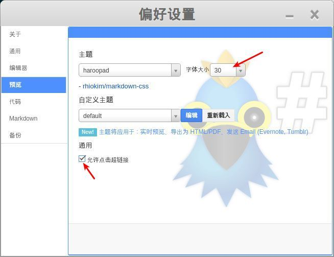

Haroopad 是一个优秀的 markdown 编辑器，非常好用。

> 备注：最近换成Typora了，更喜欢Typora的编辑方式。

###下载

从 Haroopad 官方网站下载：

http://pad.haroopress.com/user.html#download

Haroopad 支持 windows，mac 和 linux， 非常难得。

下载 `v0.13.1-x64.deb` 即可。

### 安装

安装简单,直接运行下载好的 haroopad-v0.13.1-x64.deb 就可以了.

### 设置

在高分辨屏幕(3k或者4k)下，Haroopad 的默认字体显得太小，需要设置。

打开 Haroopad ，在菜单中点 "文件" -> "偏好设置" -> "编辑器"，将默认字体设置得更大一些，比如最大的30：

"显示行号" 和 "启动 markdown 折叠" 可以视喜好选择。

然后点 "预览",同样设置字体大小。

"容许点击链接" 推荐勾选，平时方便点一下预览器的链接，以便检查链接是否正确。

