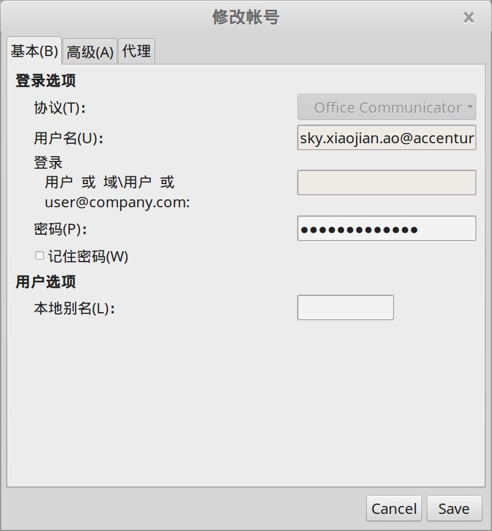

Lync (后来被微软收购之后改名为 Skype for business) 没有 linux 版本，但是我们可以通过 pidgin 这个IM通用外壳配置 sipe 插件来实现和 Lync 的兼容和相互通讯。

> 注： 方案不够完美，但是至少，可以解决有没有的问题。

## Pidgin

上一节介绍到，Linux Mint 18 自带 pidgin，也可以自行卸载再从源码编译安装到最新版本。

> 特别说明： 手工编译升级 pidgin 和 lync插件 pidpin-sipe 到最新版本之后，开始可以使用，后面不久就莫名其妙的出问题，表现为 pidgin 启动之后无法找到 pidpin-sipe 导致无法支持 office communicator 协议，但是系统又显示 pidpin-sipe 已经安装。因此建议，别折腾了，直接用仓库自带版本的 pidgin 和 pidpin-sipe 就好。

## sipe插件

sipe 项目是一个 "Protocol plugin for Office 365/Lync/OCS"，用于Adium, Pidgin, Miranda and Telepathy IM Framework。

### 简单安装

可以简单的直接从仓库安装，用软件管理器找到 pidgin-sipe 后直接安装，或者 `sudo apt-get install pidgin-sipe`。

这里得到的版本是 pidgin-sipe 1.20。测试过可以使用，能够连接到服务器。

### 源码编译安装

如果想使用最新的版本，可以自行下载源码再编译安装。

sipe项目地址：

https://sourceforge.net/projects/sipe/

下载源文件，地址:

https://sourceforge.net/projects/sipe/files/?source=navbar

此文编写时下载的版本是 `pidgin-sipe-1.21.1.tar.xz`。

### 编译安装

编译前的准备工作：

```bash
sudo apt-get install build-essential
sudo apt-get install checkinstall

sudo apt-get install libpurple-dev libtool intltool pkg-config libglib2.0-dev libxml2-dev libnss3-dev libssl-dev libkrb5-dev libnice-dev libgstreamer0.10-dev
```

找到下载的源代码文件，加压缩之后进入目录，执行编译命令：

```bash
./configure --prefix=/usr
make
sudo checkinstall
```

checkinstall 命令执行的最后输出：

```bash
Done. The new package has been installed and saved to

/home/sky/下载/pidgin-sipe-1.21.1/pidgin-sipe_1.21.1-1_amd64.deb

You can remove it from your system anytime using:

  dpkg -r pidgin-sipe
```

此时 pidgin-sipe 已经安装到系统了。

> 注： 我源码安装 pidgin-sipe 后，遇到一个灵异事件： pidgin 莫名其妙的不见了。导致后来我不得不从源代码安装 pidgin。推荐，如果不是特别喜欢追新，就别折腾了，用Linux Mint 内置的 pidgin 再简单安装二进制版本，就足以了。

## pidgin的使用

打开 pidgin，在管理账号那里添加账号，在协议一栏的下拉框中可以找到我们需要的 "office Communicator", 如果没有找到，说明 pidgin-sipe 未能安装。

### 配置

基本信息中，协议选 "Office Communicator", 用户名填写完整的邮箱地址，密码可以勾选记住密码或者不勾选每次输入：



高级信息中，只需要设置认证方案为 "TLS-DSK":


登录成功可以用了，添加好友，聊天不在话下：


## 参考文档

- [Linux Microsoft Skype For Business Lync 2013 Client](http://chrisjrob.com/2015/09/02/linux-microsoft-skype-for-business-lync-2013-client/)