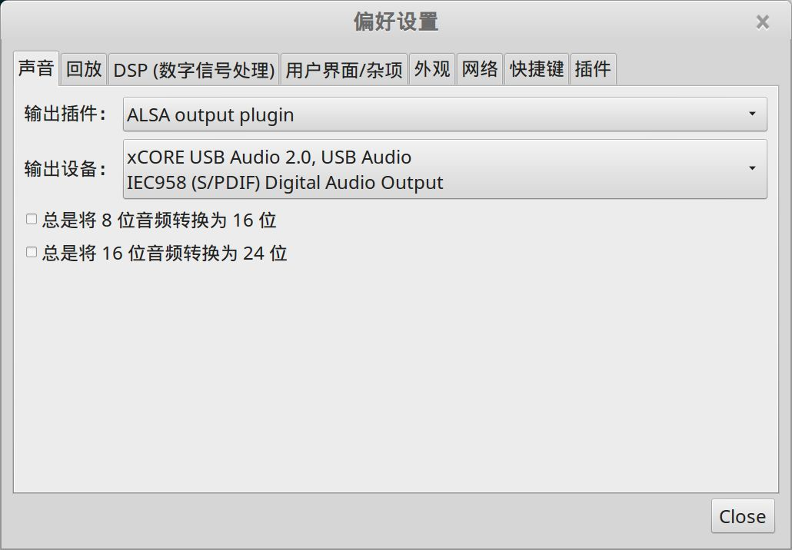

选择安装 deadbeef 的首要原因，是它支持 DSD 格式！

## 介绍

http://deadbeef.sourceforge.net/

## 安装

打开下载页面：

http://deadbeef.sourceforge.net/download.html

找到 `DeaDBeeF deb package amd64` 下载对应的 deb 文件，下载完成后直接安装即可。

## 配置

打开 "编辑" --> "偏好设置"，"声音" 选项设置如下：

"DSP(数字信号处理)" 选项中，选择 "Resampler", 点"配置"，设置如下：

默认安装之后这里的 Resampler 是 48K，导致所有 DSD 格式都是重采样为 48k 输出，因此必须修改。我的 DAC 解码器不支持 DSD 格式，只支持到 24Bit /192K ，因此这里我选择了将 DSD 重采样为 192K 输出给 DAC，虽然比真正的 DSD 效果要差，但是总比普通音源要好很多。

如果 DAC 支持 DSD 格式，可以去掉这里的 Resampler ，直接将 352K 的信号输出给 DAC。

> 注： 攒钱买 DSD 解码器中......

