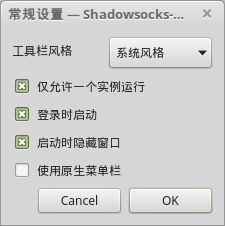

## linux客户端

从 [shadowsocks-gui](https://github.com/shadowsocks/shadowsocks-gui) 得知，linux客户端是 `shadowsocks-qt5`，提供中文版本的安装指南 。赞！

按照安装指南，执行安装：

```bash
sudo add-apt-repository ppa:hzwhuang/ss-qt5
sudo apt-get update
sudo apt-get install shadowsocks-qt5
```

安装完成后，执行命令启动：

```bash
ss-qt5
```

图形界面上可以找到shadowsocks-qt5的图标，或者gnome do 之类的工具也可以。

启动后配置和windows版本类似。

## 开机自启动

为 shadowsocks 添加开机自动启动, 点 "设置" -> "常规设置" ：




