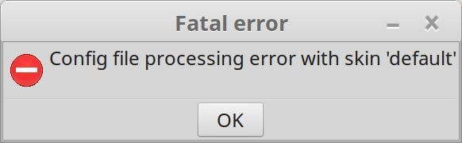

## 介绍

MPlayer被评为Linux下的最佳媒体播放工具,又成功地移植到Windows下。它能播放几乎所有流行的音频和视频格式。

MPlayer能播放几乎所有流行的音频 和视频格式，相对其它播放器来说，资源占用非常少，不需要任何系统解码器就可以播放各种媒体格式。

http://www.mplayerhq.hu/

## 安装

直接 apt 安装即可：

```bash
sudo apt-get install mplayer
```

但是很不幸，启动时报错：




google 之后发现，类似的问题从 2013 甚至更早就有，这么多年了也一直没有fix，简直......

对于 ubuntu 16.04，给出的 workaround 方式是：

```bash
sudo apt-get install imagemagick

cd /usr/share/mplayer/skins/default
for FILE in *.png; do sudo convert "$FILE" -define png:format=png24 "$FILE"; done
cd /usr/share/mplayer/skins
sudo rm default
sudo ln -s Blue default
```

> 参考文章： https://askubuntu.com/questions/593547/mplayer-bug-fix-1218510

尝试过无效，也有人建议重新安装：

```bash
sudo apt-get remove --purge mplayer
rm -r ~/.mplayer/
sudo apt-get install mplayer
sudo apt-get install mplayer-gui
```

> 参考文章： https://askubuntu.com/questions/783489/cant-use-mplayer-on-16-04-lts-x64

总之上述操作完成一遍之后，mplayer 终于能用了。我也没搞清到底是那个修复步骤最终生效的。

