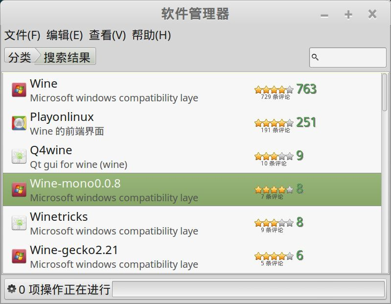

wine 是 Microsoft windows 兼容层 (windows compatibility layer), 可以在linux上跑起来一些 windows 下的软件,对于某些只有 windows 版本的软件也是一种选择.

## 安装

用mint linux的软件管理器, 搜索 `wine` :

安装以下内容:

- wine
- wine-mono0.0.8: microsoft .net framework 支持
- wine-gecho2.21

