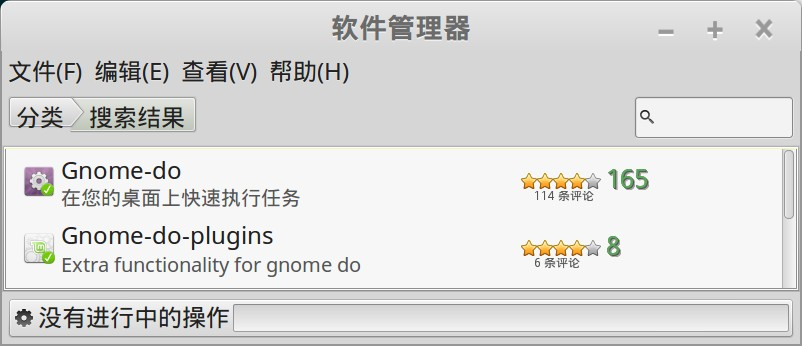
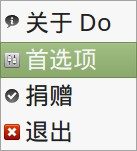
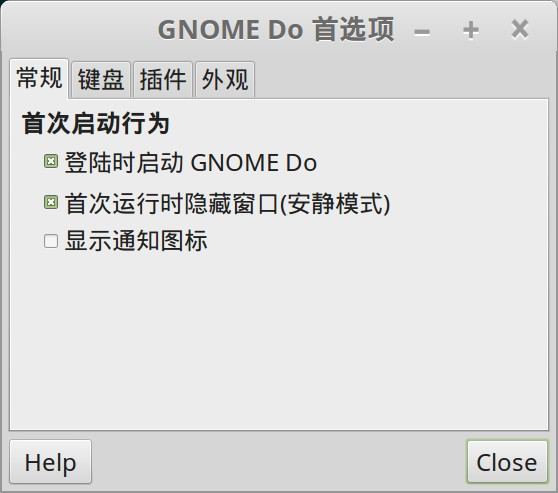
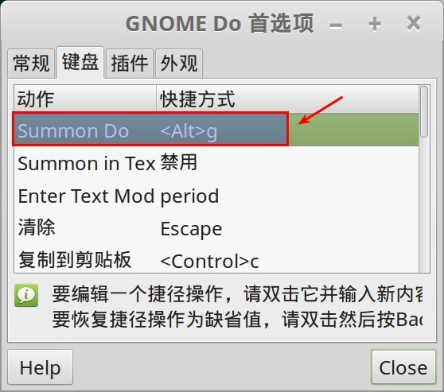
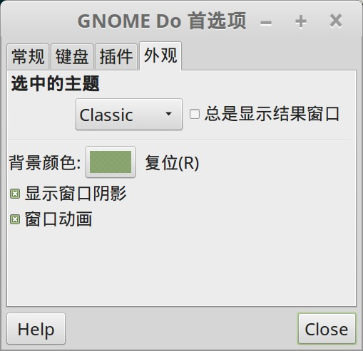
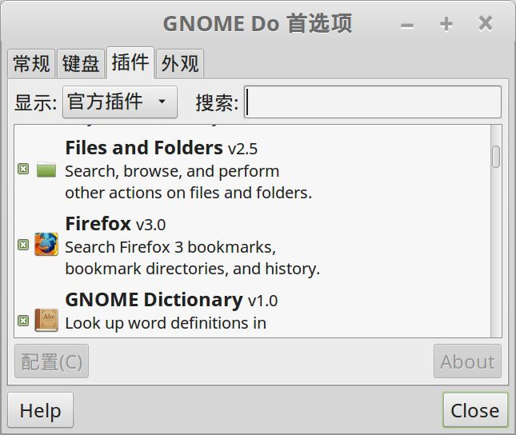

gnome-do 是一个很轻巧的应用程序启动器。

可以说是我最喜欢的小应用, 有了它之后, 打开程序或者文件就实在是太方便了，爱不释手的感觉:)

## 安装

可以通过软件管理器直接安装，"开始菜单" -> "系统管理" -> "软件管理器"，搜索 `gnome-do`：

然后直接安装

1. Gnome-do
2. Gnome-do-plugins

## 配置

安装完成之后，点 "开始菜单" -> "附件" -> "Gnome-do"， 打开Gnome-do，点右上角的小箭头，下拉菜单中选"首选项"

### 开机自启动

在"常规"中设置 "登录时启动Gnome Do":

"首次运行时隐藏窗口(安静模式)"就可以习惯了，如果不选择则开机时Gnome Do就自动运行然后停留在桌面上。喜欢一开机就用gnome do打开程序的同学可以勾选。。

### 设置快捷键

在"常规"中设置快捷键，其中最重要的是设置下面这个 "Summon Do"，用来快速调出 gnome do 程序：

### 设置外观

在"外观"中设置显示的外形和内容，主题里面有几个选择，但是还是觉得默认的好看一点：

后面的 "总是显示结果窗口"，默认没有勾选，在使用 gnome go 时，当输入的时候只会显示最匹配的一个结果，如果要切换其他结果可以用上下键。勾选之后则会在下方总是显示一个框，当输入时匹配的结果（可能有多个）就会列出来显示，同样也可以上下键选择。

## 配置插件

gnome do还支持插件：

有几个是非常好用的:

- files and folds: 可以用来指定若干个目录, 然后可以方便的用gnome do 来查找这些目录和它的子目录 (有一个深度参数可以订制子目录层次)ang
- chromium: 可以搜索google chrome 浏览器的书签, 这个特别方便
- putty: 可以访问保存的putty session

可以通过配置按钮来分别配置各个插件的使用。
