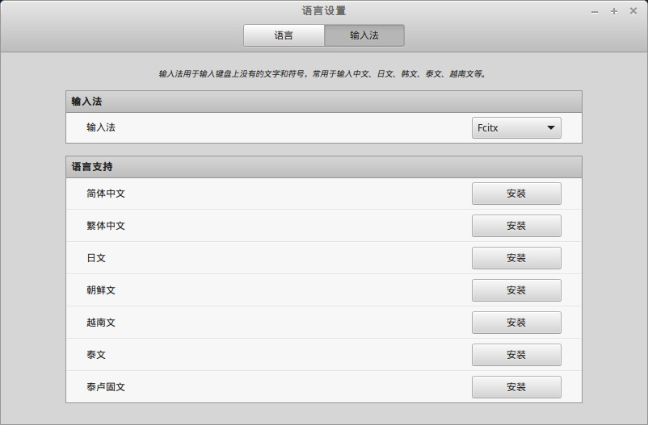
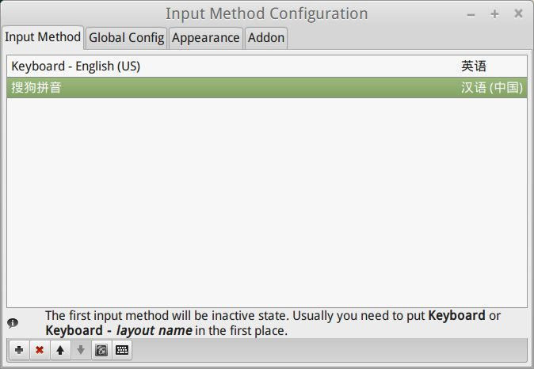
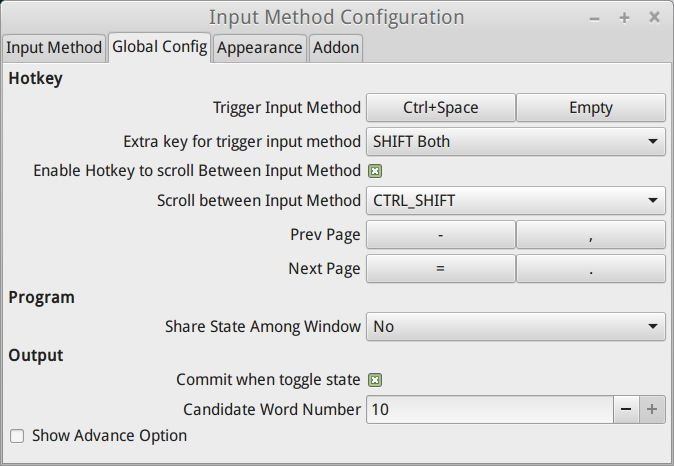
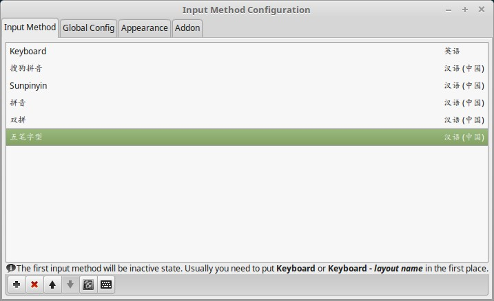

## 安装

安装步骤如下：

1. 进入搜狗输入法官网，下载 Linux 64位版本

    https://pinyin.sogou.com/linux/

    最新版本已经明确申明稳定支持 ubuntu 20.04

    在终端中执行命令：

    ```bash
    sudo dpkg -i sogoupinyin_2.1.0.0086_amd64.deb
    ```

    当这样会失败，错误信息为：

    ```
    dpkg: regarding .../sogoupinyin_2.4.0.3469_amd64.deb containing sogoupinyin:
    sogoupinyin breaks fcitx-ui-qimpanel
    fcitx-ui-qimpanel (version 2.1.3-2build1) is present and installed.

    dpkg: error processing archive /home/sky//sogoupinyin_2.4.0.3469_amd64.deb (--install):
    installing sogoupinyin would break fcitx-ui-qimpanel, and
    deconfiguration is not permitted (--auto-deconfigure might help)
    ```

	和 fcitx-ui-qimpanel 冲突，所以解决方法很简单，先卸载 fcitx-ui-qimpanel 再安装：
	
    ```bash
    sudo apt-get remove fcitx-ui-qimpanel
    ```

3. 重启系统，完成安装


## 设置

打开 "开始菜单" -> "首选项" -> "输入法"，可以看到输入法已经默认为fcitx：



点击 "简体中文" 之后的 "安装" 开始安装。

打开 "开始菜单" -> "首选项" -> "Fcitx 配置", 设置如下：



"Global Config" 里面可以看到相关的设置：



部分细节：

1. 切换输入法的快捷键是 `Ctrl+Space`
2. 上一页的快捷键是 `-` 或者 `,`
3. 下一页的快捷键是 `=` 或者 `.`
4. "Candidate Word Number"用来设置候选词的个数

可以删除部分不需要的输入法：



## 修复

偶尔会遇到搜狗输入法异常，此时解决的方式是删除`.config/SogouPY`目录，然后重新启动电脑。

注意：尝试过重新启动搜狗输入法，无效，还是需要重启机器。


## 调整字体

搜狗输入法安装之后，系统字体会发生变化，默认会变成楷体，非常不好看。

解决方案，删除下面的这两个字体文件

```bash
cd /usr/share/fonts/truetype/arphic
sudo rm -f ukai.ttc  uming.ttc
```

然后重启即可。

