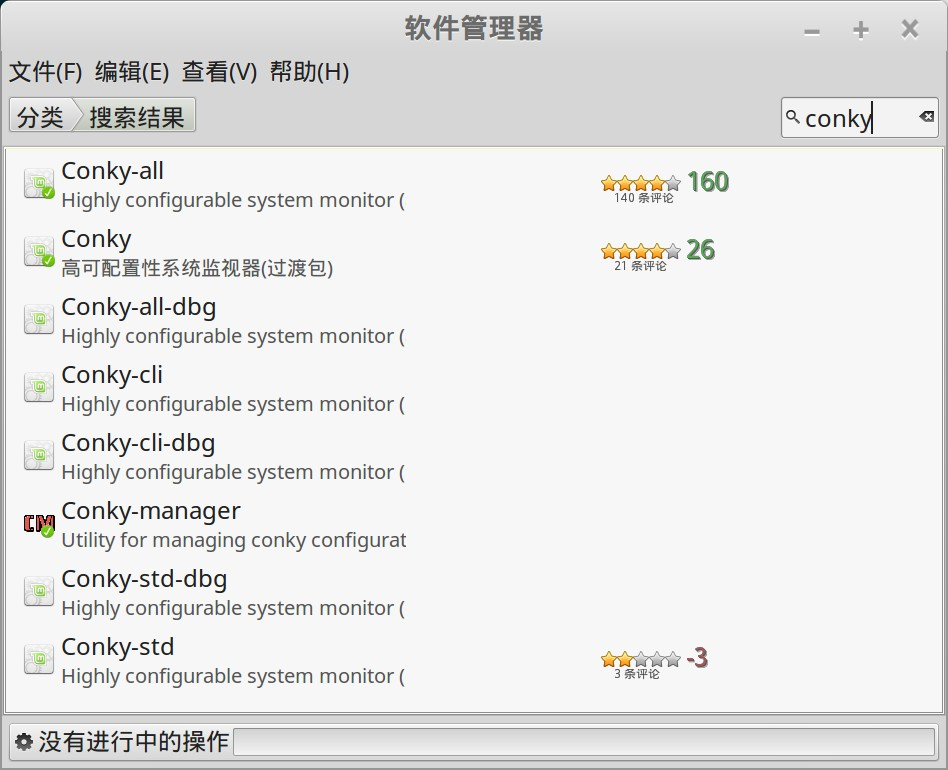
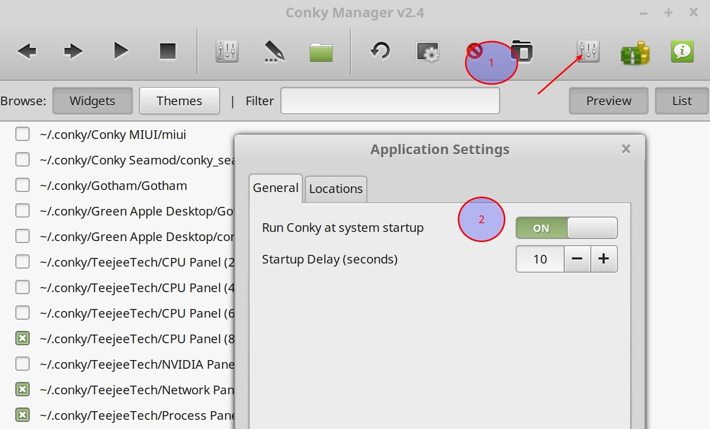
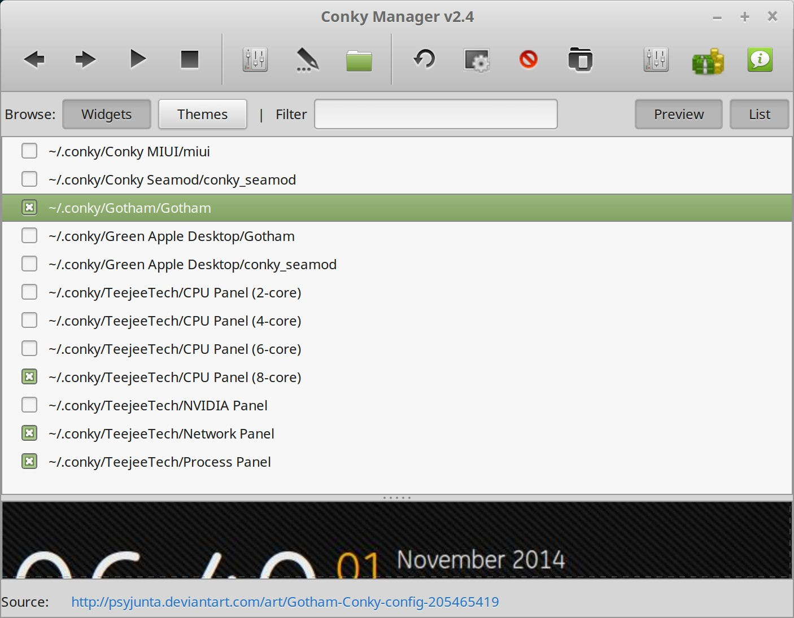
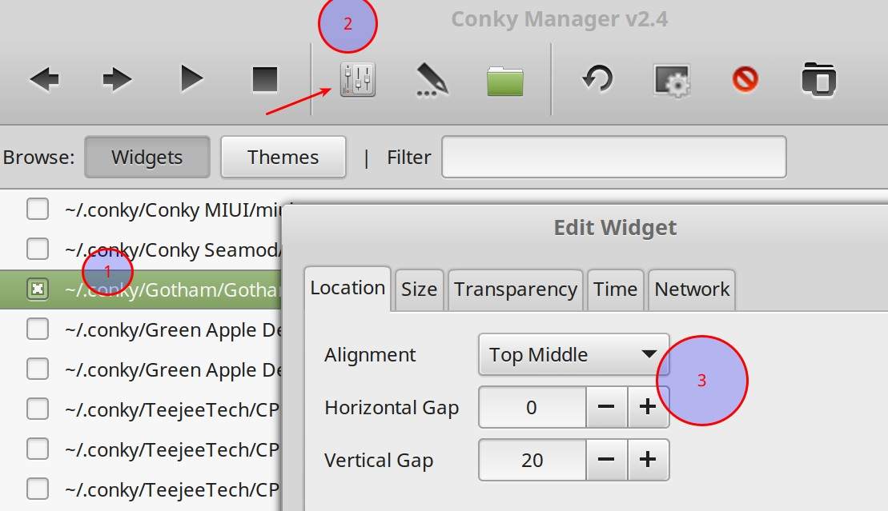
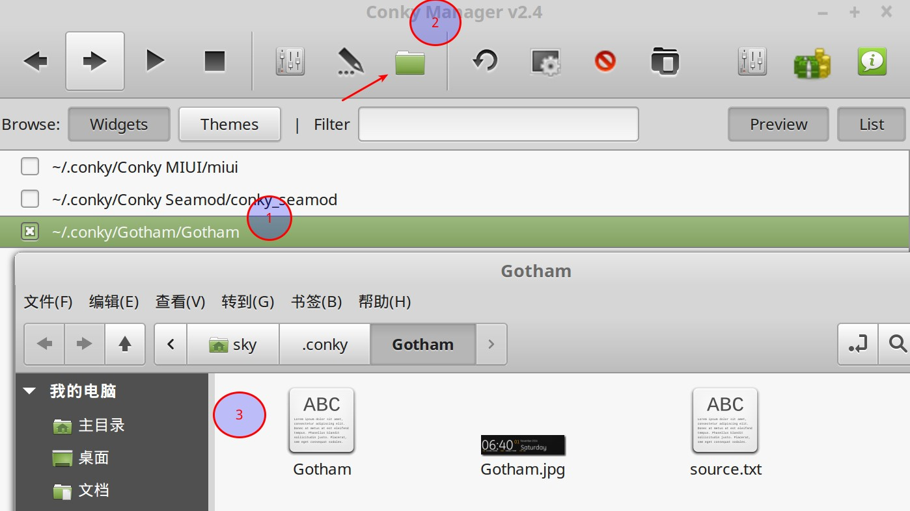
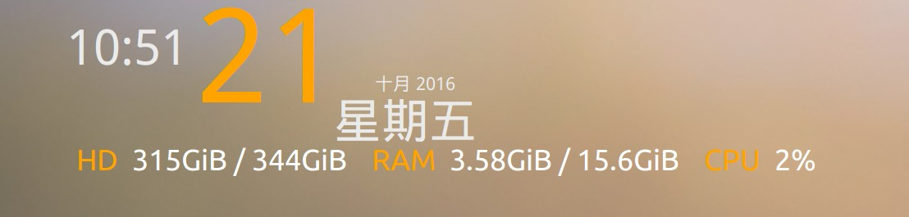

Conky 是一个轻量级的系统监控工具，非常适合日常用来监控cpu，进程，内存和网络。

## 安装

可以直接通过软件管理器安装，"开始菜单" -> "系统管理" -> "软件管理器"，搜索 conky:



然后选择安装：

1. Conky-all
1. Conky
1. Conky-manager

如果发现找不到 `Conky-manager`，请先添加ppa：

```bash
sudo add-apt-repository ppa:mark-pcnetspec/conky-manager-pm9
sudo apt-get update
sudo apt-get install conky-manager
```

> 注： conky-manager 是conky的设置界面，必须安装的，否则不方便管理。

## 配置

### 开机自启动

"开始菜单" -> "附件" -> "Conky Manager"，然后点红色箭头处的"application settings":



在这里将"Run Conky at system startup" 设置为 "on"。

### 启用 widgets

Conky Manager 下可以选择需要启用的 widgets，下面时我平时选择的四个：



### 调整 widget 位置

可以调整每个 widget 在桌面的显示位置，如下图所示：



1. 选择要调整的widget
2. 点红色箭头处的"Edit Widget"
3. 设置具体位置： Alignment 设置 widget 在桌面的位置，比如"Top Middle" 表示 "屏幕顶部中间位置"。

### 调整 widget 样式

widget 样式可以详细调节，如下图所示：



1. 选择要调整的widget
2. 点红色箭头处的"Open Theme Folder"
3. 修改gotham文件

具体的参数没有找到文档，不过可以自己摸索，最下面这一段就是控制显示的内容，自行修改比如字体大小，然后保存之后conky会自动装载，对比前后效果就知道了。

```bash
minimum_size 0 0
TEXT
${voffset 10}${color EAEAEA}${font GE Inspira:pixelsize=120}${time %H:%M}${font}${voffset -84}${offset 10}${color FFA300}${font GE Inspira:pixelsize=160}${time %d} ${voffset -15}${color EAEAEA}${font Ubuntu Regular Inspira:pixelsize=22}${time  %B} ${time %Y}${font}${voffset 24}${font Ubuntu Regular Inspira:pixelsize=58}${offset -148}${time %A}${font}
${voffset 1}${offset 12}${font Ubuntu:pixelsize=36}${color FFA300}HD ${offset 9}$color${fs_free /} / ${fs_size /}${offset 30}${color FFA300}RAM ${offset 9}$color$mem / $memmax${offset 30}${color FFA300}CPU ${offset 9}$color${cpu cpu0}%
```

特别注意：如果出现乱码，就需要修改字体，默认GE，改为 Ubuntu Regular 之类。

举例，gothem 在我的笔记本上(3k分辨率 + 双倍dpi)显示不正常，文件重叠，修改之后就正常了。



