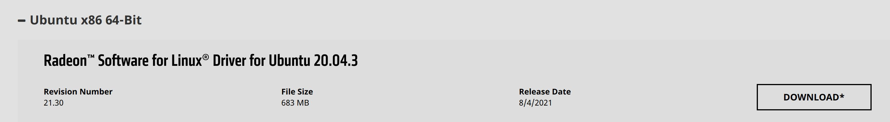
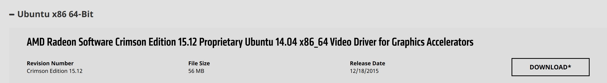

## 最新显卡

以 amd rx6800xt为例，AMD 的 linux 驱动非常更新及时，可以很好的支持最新的显卡。

在amd官方的支持页面

https://www.amd.com/en/support

选择 "Graphics" --> "AMD Redeon 6000 Series"  一路选择型号，然后点击"提交"。在结果中选择 "Ubuntu x86 64-Bit" ,



下载下来 amdgpu-pro-21.30-1290604-ubuntu-20.04.tar.xz，解压缩进入目录，执行:

```bash
cd amdgpu-pro-21.30-1290604-ubuntu-20.04
sudo ./amdgpu-install
```

一路安装即可。

## 老显卡

以 amd r5 240 1G 为例，这样的十年前的老显卡已经找到不到最新 ubuntu release 的驱动了。比如这个卡的最新版本也只是2015年的，只支持到 ubuntu 15.12。



不过，linux mint 自带了这些老显卡的驱动，虽不清楚这些驱动的版本和能力，但考虑到本来就是作为良机卡，足够了。

{}
注意：千万不要用上面的最新显卡驱动进行安装！

问题：安装过程会顺利完成，重启之后不仅仅新驱动无法启用，连原来自带的驱动也无法使用。

解决方式：通过上面的安装包，执行 `sudo ./amdgpu-uninstall` 卸载最新驱动，重启之后恢复自带驱动。
{}