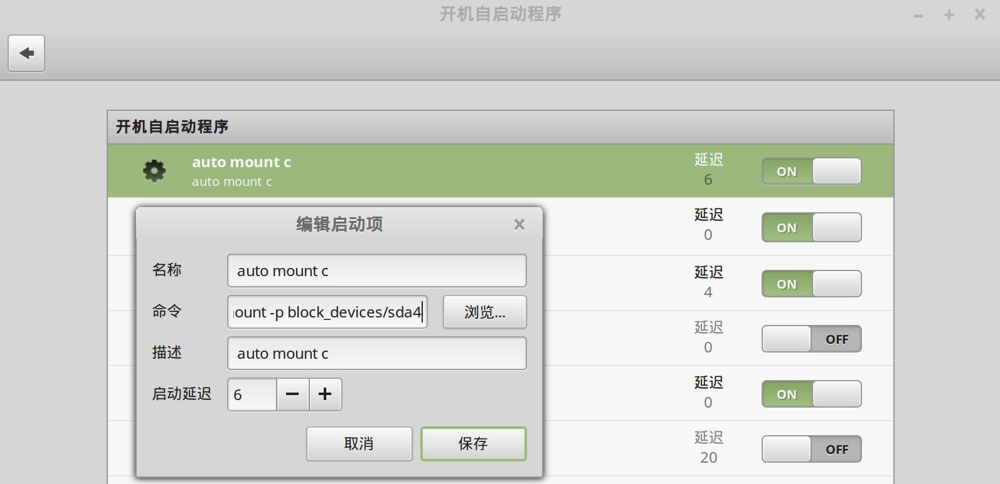

安装linux、windows双操作系统时，可以在linux下直接挂载windows的盘符，这样可以访问windows下的文件系统，非常方便。

新版本的ubuntu16.04、Linux mint 18都已经内置了ntfs的支持，只需要简单挂载就好。最方便的方式是在开机时自动挂载。

## 只读挂载

如果只是要求读取文件，不要求写入，则非常简单。开机自动执行 udisksctl 命令即可解决问题。

### 设置开机自动挂载

在开机自启动程序中，增加一个开机启动项，命令为：

```bash
udisksctl mount -p block_devices/nvme0n1p4
```



### 解决无法装载的问题

如果windows在关机时进行了休眠，则无法装载，报错如下：

```bash
Error mounting /dev/nvme0n1p4 at /media/sky/win10: Command-line `mount -t "ntfs" -o "uhelper=udisks2,nodev,nosuid,uid=1000,gid=1000" "/dev/nvme0n1p4" "/media/sky/win10"' exited with non-zero exit status 14: Windows is hibernated, refused to mount.
Failed to mount '/dev/nvme0n1p4': 不允许的操作
The NTFS partition is in an unsafe state. Please resume and shutdown
Windows fully (no hibernation or fast restarting), or mount the volume
read-only with the 'ro' mount option.
```

解决这个问题的最好方式是消除休眠状态。一般重新启动到windows下，然后再次重启进linux，就OK。

前提是已经关闭了windows的快速启动功能，不然还会继续报同样错误。关闭快速启动的办法是进入windows，在控制面板 -> 电源管理中，选择关闭盖子的功能，点击"不能更改的选项"，去掉快速启动的勾选。

但偶尔还是会遇到即使上面的事情都做好了，依然还是继续报错说"Windows is hibernated"。

此时需要想办法删除windows盘符上的休眠文件`hiberfil.sys`，具体作法是在linux中执行命令：

```bash
sudo mkdir /media/sky/win10
sudo ntfs-3g -o remove_hiberfile /dev/nvme0n1p4 /media/sky/win10
```

最恶劣的情况是，windows在即使关闭快速启动功能的情况下也还是会继续生成休眠文件，非常不可理喻。解决的方式是彻底关闭windows的休眠功能。以管理员权限启动命令行，执行命令：

```bash
powercfg /h off
```

### 参考资料

- [How to Do a Full Shutdown in Windows 8 Without Disabling Hybrid Boot](https://www.howtogeek.com/129021/how-to-do-a-full-shutdown-in-windows-8-without-disabling-hybrid-boot/)
- [How to mount Windows (NTFS) filesystem due to hibernation](https://wiki.manjaro.org/How_to_mount_Windows_(NTFS)_filesystem_due_to_hibernation): 这篇讲的很详细

## 读写挂载

如果要求有写入权限，则推荐直接修改 `/etc/fstab` 文件。

```bash
sudo vi /etc/fstab
```

加入以下内容：

```bash
/dev/nvme0n1p6   /media/d ntfs-3g user,auto,rw,dev,exec,suid,async,utf8,dmask=000,fmask=111 0 0 
```

其中 `/dev/nvme0n1p6` 是要挂载的 windows ntfs 盘符。可以通过 

```bash
sudo fdisk -l
```

查看 device 名称：

```bash
Disk /dev/nvme0n1: 3.49 TiB, 3840755982336 bytes, 7501476528 sectors
Disk model: KCD61LUL3T84                            
Units: sectors of 1 * 512 = 512 bytes
Sector size (logical/physical): 512 bytes / 4096 bytes
I/O size (minimum/optimal): 4096 bytes / 4096 bytes
Disklabel type: gpt
Disk identifier: FBEFBE02-9843-4FEC-8B2C-C50B5EAD8069

Device              Start        End    Sectors   Size Type
/dev/nvme0n1p1       2048     206847     204800   100M EFI System
/dev/nvme0n1p2     206848     239615      32768    16M Microsoft reserved
/dev/nvme0n1p3     239616 1047643943 1047404328 499.4G Microsoft basic data
/dev/nvme0n1p4 1047644160 1048813567    1169408   571M Windows recovery environment
/dev/nvme0n1p5 1048815616 2097391615 1048576000   500G Microsoft basic data
/dev/nvme0n1p6 2097391616 7340271615 5242880000   2.4T Microsoft basic data
/dev/nvme0n1p7 7340271616 7501475839  161204224  76.9G Microsoft basic data
```

或者用 uuid 来指定要挂载的盘符，执行 

```bash
sudo lsblk -f
```

来查看各个盘符的 uuid：

```bash
NAME        FSTYPE FSVER LABEL UUID                                 FSAVAIL FSUSE% MOUNTPOINTS
nvme0n1                                                                            
├─nvme0n1p1 vfat   FAT32       900E-C1BF                              64.9M    32% /boot/efi
├─nvme0n1p2                                                                        
├─nvme0n1p3 ntfs               DA58F6BA58F6948B                                    
├─nvme0n1p4 ntfs               9AAA6103AA60DD6F                                    
├─nvme0n1p5 ext4   1.0         9f09256f-e5b1-4aa2-894f-bb77605d58dc  358.5G    22% /
├─nvme0n1p6 ntfs         data  2E3236E83236B4A5                        1.5T    37% /media/d
└─nvme0n1p7 ext4   1.0         00b99ea7-c250-40af-b07e-3b2378c830cf   11.8G    79% /timeshift
```

然后类似的修改 `/etc/fstab` 文件：

```bash
UUID=2E3236E83236B4A5 /media/d ntfs-3g user,auto,rw,dev,exec,suid,async,utf8,dmask=000,fmask=111 0 0
```

如果遇到依然没有权限写入，则有可能是该 windows ntfs 盘符有问题，可以先进入 windows，用磁盘工具检查一遍这个盘符。之后重启进入 linux 应该就可以写入了。
