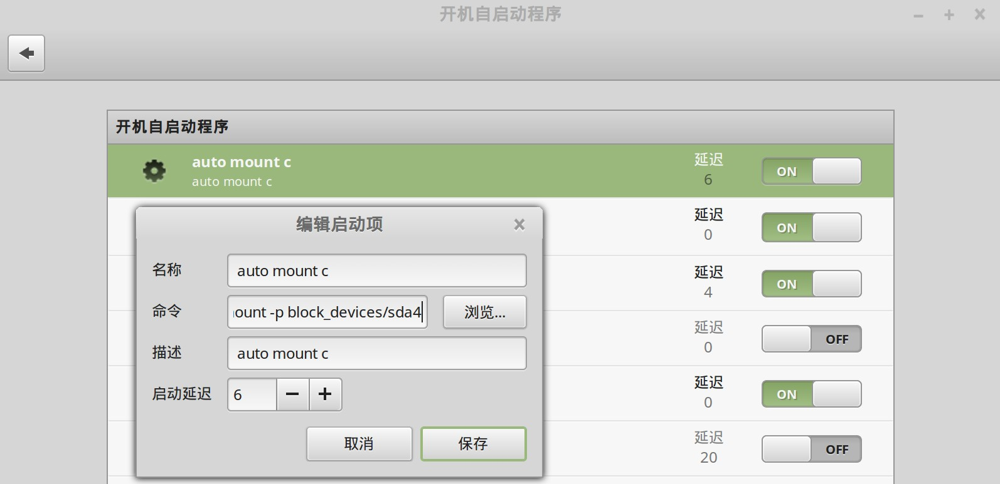

linux mint 安装之后自带了ntfs-3g, 天然支持ntfs格式。

"开始菜单" -> "首选项" -> "开机自启动程序"，在开机自启动程序中增加开机自动装载windows分区的命令:

```bash
udisksctl mount -p block_devices/sdb4
```

具体有哪些分区可供装载，可以通过在命令行中输入 `udisksctl mount -p block_devices/` 然后双击 Tab 键列出来，如下图：

```bash
udisksctl mount -p block_devices/
block_devices/nvme0n1p3   block_devices/nvme1n1p1   block_devices/sda3 
block_devices/nvme0n1p4   block_devices/nvme1n1p2   block_devices/sdb1 
```

具体对应的磁盘，可以用系统自带的 "磁盘" 工具查看对照。

开机自启动设置如下：



以下是命令参考：

```bash
# element 移动硬盘
udisksctl mount -p block_devices/sda1

# window d 盘
udisksctl mount -p block_devices/sda2

# window c 盘
udisksctl mount -p block_devices/nvme0n1p3
```


