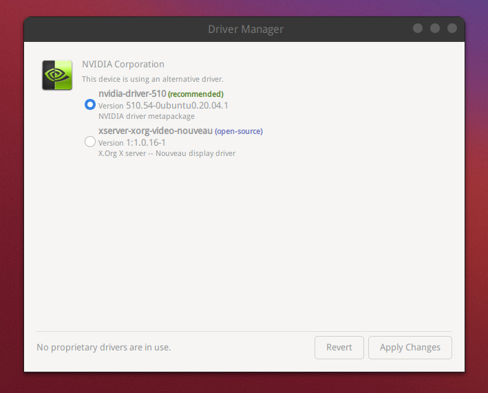

## 驱动安装

"开始菜单" -> "系统管理" -> "驱动管理器"，

Linux Mint 会先做一次系统更新检查，然后给出可以安装的驱动列表。

只要简单选择需要的驱动版本，然后安装即可，如下图：

特殊情况：

有时会遇到无法打开系统设置界面的情况，导致无法进入设备管理器。

此时，可以在桌面右键，打开终端，然后执行 `/usr/bin/cinnamon-settings` 命令，即可打开设置界面。

