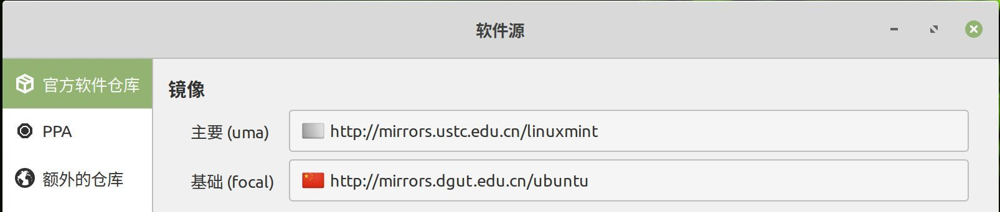
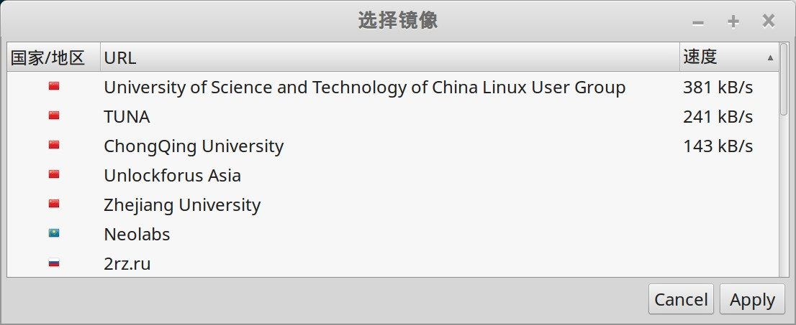

Linux Mint 19 的安装比较简单，安装速度也非常快。

但是期间还是有一些事情要小心。

## 安装前准备

从 Linux Mint 的下载页面下载  Cinnamon 的 64位版本。

https://linuxmint.com/download.php

之后使用各种工具将下载下来的 ISO 文件制作成启动 U 盘进行安装。

## 安装

安装时，在选择安装盘符时需要注意：

1. 最好单独再建立一个 EFI 分区，不要使用原有 windows 的EFI分区，大小一般128M足以
2. 由于docker的原因，建议不建立交换分区
3. 特别注意：启动信息那里一定要选择我们为linux新建的 EFI 分区

安装过程中，如果提醒是否要下载更新，选择 no。原因是安装时使用的源是 Linux Mint 默认的源，对于国内用户速度很慢。建议选择在安装完成之后，再设置好国内速度快的源，然后再更新，速度就非常好。

### 语言选择

推荐在安装过程中就选择好 简体中文，不要安装完之后再设置。虽然没有证据，但是总觉得这样对中文的支持要好一些，避免麻烦。

### 自动登录

安装过程在设置用户名密码时，有个是否自动登录的选项，如果是自己机器平时也不需要考虑安全性，选上，可以省事加开机更快。

## 更新源

安装完成，进入桌面之后的第一件事情，就是设置软件源。

"开始菜单" -> "系统管理" -> "软件源"，然后就可以设置镜像，包括主要和基础两个：

选择时会自动提供速度测试，可以根据测试出来的速度情况选择一个速度比较好的源，我这边选择的是 ustc 。

注意一定要先更新源之后，再开始各种配置和安装，避免国外源时速度不好。
