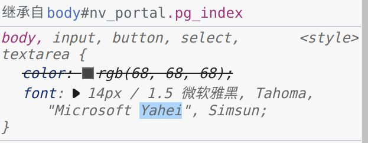
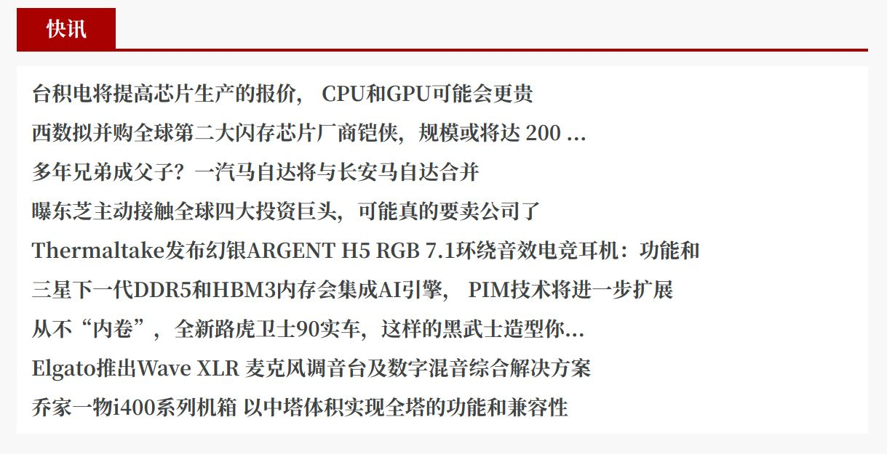
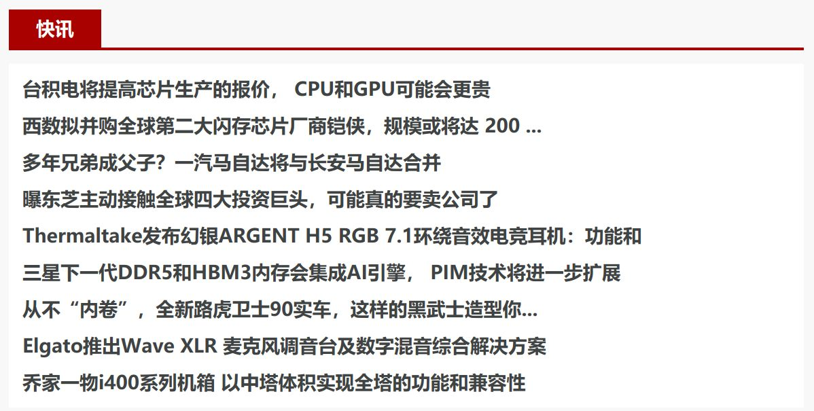

### 添加微软雅黑字体

某些网站会指定使用微软雅黑字体，而 linux mint 默认不带微软雅黑字体，因此在显示上会很难看。比如 https://www.chiphell.com/ 网站的首页，指定的首选字体微软雅黑是：



但由于缺少字体，导致使用宋体显示：



这样的文字看起来就很累了：


解决方式就是要添加微软雅黑字体，具体步骤：

1. 从win10系统中提取出字体文件 ：一般在`c:/Windows/Fonts`目录下

2. 在linux mint 系统字体文件夹中建立对应的字体文件夹

    ```bash
    cd Windows/Fonts
    sudo mkdir /usr/share/fonts/msyh
    sudo cp msyh.ttc msyhbd.ttc msyhl.ttc /usr/share/fonts/msyh/
    sudo fc-cache  -fv
    
    /usr/share/fonts/msyh: 正在生成缓存，新增缓存内容：6 个字体，0 个目录
    ```
    
3. 刷新网页：注意要让字体生效，需要关闭浏览器进程，然后重新打开，不然不会装载新增的字体

下面是增加雅黑字体之后chh的显示效果，可以和上面的图片对比：




### 修改默认字体为文泉微米等宽黑

文泉微米等宽黑的介绍和评价参考：

- [文泉驿微米黑的评价怎样？](https://www.zhihu.com/question/19772565)

官方下载地址：

http://wenq.org/wqy2/index.cgi?Download#MicroHei_Beta

ubuntu可以直接用 apt-get 安装：

```bash
sudo apt-get install fonts-wqy-microhei
```

这样下载安装的是 `fonts-wqy-microhei_0.2.0-beta-3_all.deb` 版本。

也可以在这个页面手工下载deb安装包，版本是 `fonts-wqy-microhei_0.2.0-beta-3.1_all`：

https://debian.pkgs.org/sid/debian-main-amd64/fonts-wqy-microhei_0.2.0-beta-3.1_all.deb.html


打开菜单-->首选项--> 选择字体，默认字体设置如下：

- Default Font: Ubuntu Regular 10
- Desktop Font: Ubuntu Regular 10
- Document Font: Sans Regular 10
- Monospace Font: DejaVu Sans Mono Book 10
- Window title front: Ubutu Medium 10

一律修改成文泉驿等宽微米黑，字体大小也适当加大。

- Default Font: Wenquanyi Micro Hei Regular 10
- Desktop Font: Wenquanyi Micro Hei Regular 10
- Document Font: Wenquanyi Micro Hei Regular 10
- Monospace Font: Wenquanyi Micro Hei Mono Regular 10
- Window title front: Wenquanyi Micro Hei Regular 10

> 备注：如果找不到文泉驿字体，请执行 `sudo fc-cache  -fv` 命令刷新字体缓存。

{}
更换文泉驿字体后，整体界面比默认风格要好看太多了。强烈推荐！
{}

### 移除不需要的字体

有些地方的字体会继续保留为楷体，需要在软件管理器中，找到"Fonts-arphic-ukai"和"Fonts-arphic-uming"，移除这两个字体。

重新启动后，可以发现原来的一些字体比如命令行下的楷体（默认，超级丑）就变为前面设置的文泉微米等宽黑了。

备注：

1. 如果没有如上面所示设置好字体就直接删除 "Fonts-arphic-ukai"和"Fonts-arphic-uming" 这两个字体，就会出现因为字体缺失而造成的乱码现象。因为这两个字体在某些情况下是缺省字体

2. 如果安装的是英文版，会不自带这两个字体。而在安装简体中文包时会附带安装这两个字体，从而继续引发这个问题。解决的方式是在简体中文包安装完成之后再删除这两个字体。

3. 必须重启或者注销当前用户，然后重新登录，才能生效。

### 设置命令行窗口字体

打开命令行，"编辑" -> "首选项" 中勾选自定义自体，适当放大字体，默认12,可以考虑20。

字体设置为 DejaVu Sans Mono 比较好看。
