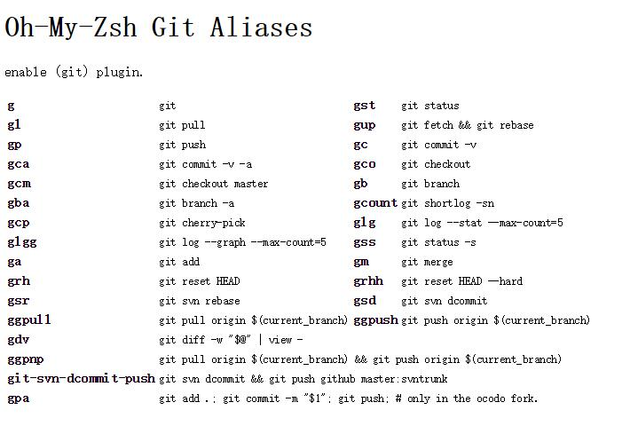

## 背景

zsh的功能极其强大，只是配置过于复杂，起初只有极客才在用。后来，一些极客为了让更多人受益，开发了Oh-my-zsh这个插件，用来简化zsh的配置，让zsh更加容易上手。

官网地址：

https://github.com/ohmyzsh/ohmyzsh

## 安装

首先安装 zsh：

```bash
sudo apt install zsh zsh-doc
```

然后安装ohmyzsh，中途询问是否把zsh作为默认shell时选择Y：

```bash
sh -c "$(wget -O- https://raw.githubusercontent.com/ohmyzsh/ohmyzsh/master/tools/install.sh)"

Do you want to change your default shell to zsh? [Y/n] Y
Changing the shell...
```

## 配置

### 关闭自动粘贴转义

Oh-my-zsh 默认开启自动粘贴转义，容易造成问题，建议关闭，修改 .zshrc 文件：

```bash
# Uncomment the following line if pasting URLs and other text is messed up.
# 把这里的注释取消即可
DISABLE_MAGIC_FUNCTIONS="true"
```

### 配置插件

https://github.com/ohmyzsh/ohmyzsh/wiki/Plugins

Oh-my-zsh 默认将插件存放在 `~/.oh-my-zsh/plugins` 目录下，数量非常多：

```bash
➜  ~ cd .oh-my-zsh/plugins 
➜  plugins git:(master) ls
adb                composer        frontend-search           ipfs              n98-magerun            redis-cli      terraform
ag                 copybuffer      fzf                       isodate           nanoc                  repo           textastic
aliases            copydir         gas                       iterm2            ng                     ripgrep        textmate
alias-finder       copyfile        gatsby                    jake-node         nmap                   ros            thefuck
ansible            cp              gb                        jenv              node                   rsync          themes
ant                cpanm           gcloud                    jfrog             nomad                  ruby           thor
apache2-macports   dash            geeknote                  jhbuild           npm                    rust           tig
arcanist           debian          gem                       jira              npx                    rustup         timer
archlinux          deno            genpass                   jruby             nvm                    rvm            tmux
asdf               dircycle        gh                        jsontools         oc                     safe-paste     tmux-cssh
autoenv            direnv          git                       jump              octozen                salt           tmuxinator
autojump           dirhistory      git-auto-fetch            kate              osx                    samtools       torrent
autopep8           dirpersist      git-escape-magic          keychain          otp                    sbt            transfer
aws                django          git-extras                kitchen           pass                   scala          tugboat
battery            dnf             gitfast                   knife             paver                  scd            ubuntu
bazel              dnote           git-flow                  knife_ssh         pep8                   screen         ufw
bbedit             docker          git-flow-avh              kops              percol                 scw            universalarchive
bedtools           docker-compose  github                    kubectl           per-directory-history  sdk            urltools
bgnotify           docker-machine  git-hubflow               kubectx           perl                   sfdx           vagrant
boot2docker        doctl           gitignore                 kube-ps1          perms                  sfffe          vagrant-prompt
bower              dotenv          git-lfs                   lando             phing                  shell-proxy    vault
branch             dotnet          git-prompt                laravel           pip                    shrink-path    vim-interaction
brew               droplr          glassfish                 laravel4          pipenv                 singlechar     vi-mode
bundler            drush           globalias                 laravel5          pj                     spring         virtualenv
cabal              eecms           gnu-utils                 last-working-dir  please                 sprunge        virtualenvwrapper
cake               emacs           golang                    lein              pm2                    ssh-agent      vscode
cakephp3           ember-cli       gpg-agent                 lighthouse        pod                    stack          vundle
capistrano         emoji           gradle                    lol               postgres               sublime        wakeonlan
cargo              emoji-clock     grails                    lxd               pow                    sublime-merge  wd
cask               emotty          grc                       macports          powder                 sudo           web-search
catimg             encode64        grunt                     magic-enter       powify                 supervisor     wp-cli
celery             extract         gulp                      man               profiles               suse           xcode
chruby             fabric          hanami                    marked2           pyenv                  svcat          yarn
chucknorris        fancy-ctrl-z    helm                      mercurial         pylint                 svn            yii
cloudfoundry       fasd            heroku                    meteor            python                 svn-fast-info  yii2
codeclimate        fastfile        history                   microk8s          rails                  swiftpm        yum
coffee             fbterm          history-substring-search  minikube          rake                   symfony        z
colemak            fd              hitchhiker                mix               rake-fast              symfony2       zbell
colored-man-pages  firewalld       hitokoto                  mix-fast          rand-quote             systemadmin    zeus
colorize           flutter         homestead                 mongocli          rbenv                  systemd        zoxide
command-not-found  fnm             httpie                    mosh              rbfu                   taskwarrior    zsh-interactive-cd
common-aliases     forklift        invoke                    mvn               react-native           terminitor     zsh-navigation-tools
compleat           fossil          ionic                     mysql-macports    rebar                  term_tab       zsh_reload
```

比较常用的：

- git
- golang
- rust / rustup
- docker / docker-compose / docker-machine
- kubectl
- npm / node
- mvn
- sudo
- helm
- redis-cli
- ubuntu / ufw
- wd
- zsh-autosuggestions
- zsh-syntax-highlighting
- history-substring-search

#### 小结

最后启动的插件如下所示：

```
plugins=(git golang rust rustup docker docker-compose docker-machine kubectl npm node mvn sudo helm redis-cli ubuntu ufw wd zsh-autosuggestions zsh-syntax-highlighting history-substring-search)
```

### 配置样式

https://github.com/ohmyzsh/ohmyzsh/wiki/Themes

暂时先用默认。

## 附录：常用插件用法

### git插件

开启 git 插件后就可以使用以下简写命令了：



更多细节参见：

https://github.com/ohmyzsh/ohmyzsh/tree/master/plugins/git

### wd插件

可以快速切换到常用目录。

先安装 wd:

```bash
wget --no-check-certificate https://github.com/mfaerevaag/wd/raw/master/install.sh -O - | sh
```

使用方法：

```bash
# 进入某个目录
cd work/code/learning
pwd
/home/sky/work/code/learning
# 添加到wd
wd add learning
# 之后就可以用wd命令直接进入了
wd learning

# 方便期间，常见的学习笔记都加入wd，以l为前缀
/home/sky/work/code/learning/learning-rust
wd add lrust
```

详细使用参考：https://github.com/mfaerevaag/wd 

### sudo插件

按 2 次 esc 会在命令前自动输入 sudo

### zsh-autosuggestions插件

根据历史记录智能自动补全命令，输入命令时会以暗色补全，按方向键右键完成输入。

安装命令：

```bash
git clone https://github.com/zsh-users/zsh-autosuggestions $ZSH_CUSTOM/plugins/zsh-autosuggestions
```

### zsh-syntax-highlighting插件

fish shell 风格的语法高亮插件。输入的命令根据主题自动高亮。

安装命令：

```bash
git clone https://github.com/zsh-users/zsh-syntax-highlighting.git $ZSH_CUSTOM/plugins/zsh-syntax-highlighting
```

### history-substring-search 插件

历史命令搜索插件，如果和 zsh-syntax-highlighting 插件共用，要配置到语法高亮插件之后。

安装命令：

```bash
git clone https://github.com/zsh-users/zsh-history-substring-search.git $ZSH_CUSTOM/plugins/history-substring-search
```

## 参考资料

- [Oh My Zsh 替换你的 Bash Shell](https://3w.vercel.app/2016/09/24/using-oh-my-zsh/)