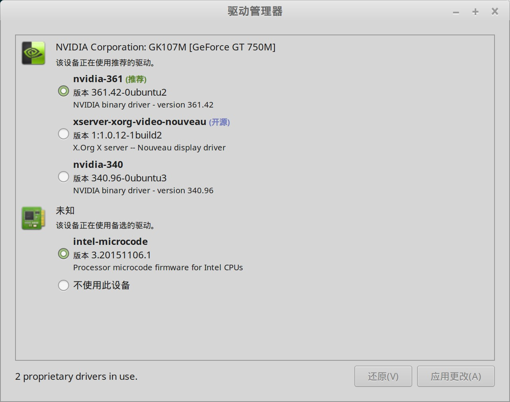

## 驱动安装

"开始菜单" -> "系统管理" -> "驱动管理器"，

Linux Mint 会先做一次系统更新检查，然后给出可以安装的驱动列表。

只要简单选择需要的驱动版本，然后安装即可，如下图：

### 笔记本节能设置

为了节能，在右下角找到 nvidia 的图标，设置中找到 ”select the gpu you would like to use”，默认时NVIDIA，修改为 Intel，这样平时用 Intel 集显比较节能省电噪音低。

然后，在需要用到 nvidia 独立显卡时，可以再改回来。

