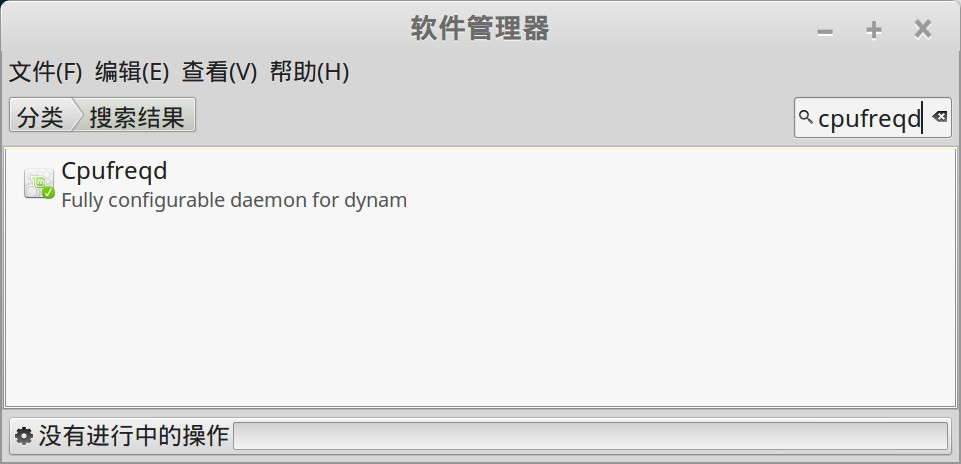
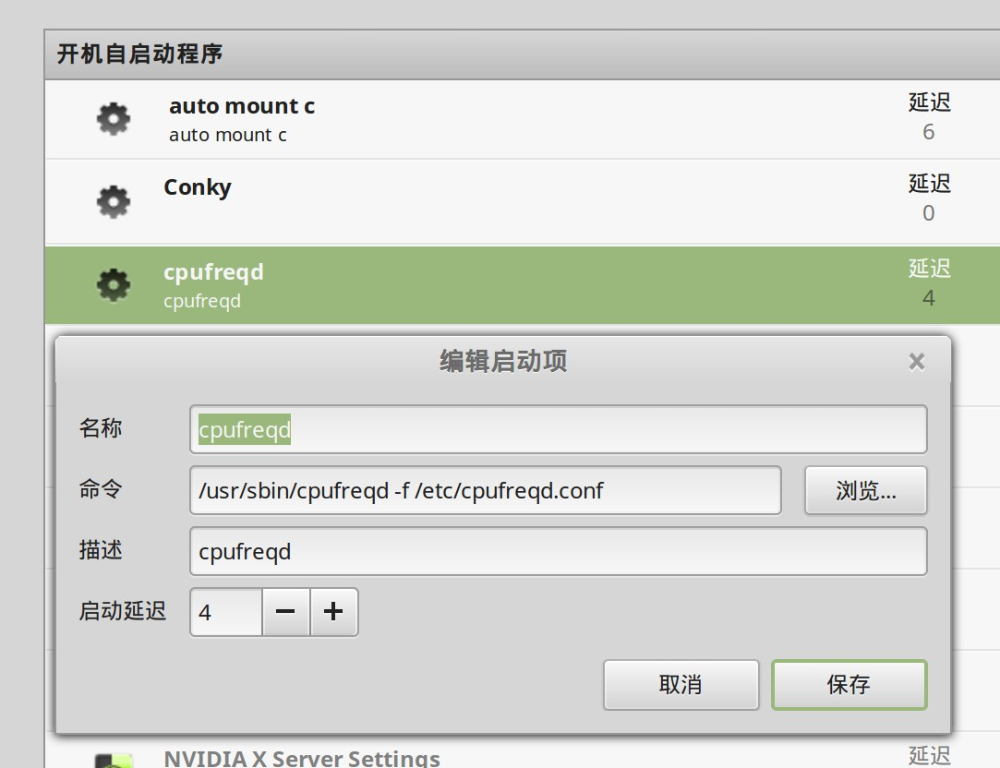

{}
归档说明：已经很久没有在笔记本上折腾linux了，台式机没必要。
{}

折腾 linux mint 的时候,发现linux系统节能方面表现不太好. 后来找到了cpufreqd这个工具, 使用后发现非常好用,可以自定义规则来满足各种情况下的cpu设定, 极度灵活。

叹为观止, 在 cpu 频率调整方面堪称神器，强烈推荐给笔记本用户.

##  安装

linux mint 中发现直接用软件管理器安装，不用添加ppa。

"开始菜单" -> "系统管理" -> "软件管理器"，搜索 `cpufreqd`:



直接安装即可。

## 配置

### 设置配置文件

cpufreqd 的精髓在于它可以通过配置文件来定制行为, 下面可以看到cpufreqd启动时时读取/etc/cpufreqd.conf中的配置信息:

```bash
$ ps -ef | grep cpu
root      1910     1  0 14:19 ?        00:00:01 /usr/sbin/cpufreqd -f /etc/cpufreqd.conf
```

 cpufreqd.conf详细的配置文档说明请见下文(英文版): [cpufreqd.conf - configuration file for cpufreqd](http://manpages.ubuntu.com/manpages/natty/man5/cpufreqd.conf.5.html).

### 开机自启动

cpufreqd 是一个命令行工具，因此开机自启动需要手工添加。

"开始菜单" -> "首选项" -> "开机自启动程序"，如图添加：



## 定制方案

### 注意事项

在使用 cpufreqd 调节时，最好能实时查看 linux 的系统日志，如果调节不成功，则系统日志中会有错误信息。

```bash
tail -f /var/log/syslog
```

然后通过 conky 等工具实时查看 cpu 频率，可以知道是否调整符合预期。

常见的几个问题：

1. policy 的支持，一般只支持到 performance 和 powersave 两种，如果设置为ondemand可能会报错
2. cpu频率设置的太低，如果超过cpu物理支持的最低频率，也会报错
3. rule名字重名

### 我的定制方案

下面是我给自己定制的cpu频率设置，给笔记本用的:

```bash
[Rule]
name=on-high
ac=on
acpi_temperature=0-50
cpu_interval=20-100
profile=high
[/Rule]

[Rule]
name=on-normal
ac=on
acpi_temperature=50-60
cpu_interval=20-100
profile=normal
[/Rule]

[Rule]
name=on-low
ac=on
cpu_interval=0-20
profile=low
[/Rule]

[Rule]
name=off-high
ac=off
acpi_temperature=0-50
cpu_interval=20-100
profile=high
[/Rule]

[Rule]
name=off-normal
ac=off
acpi_temperature=50-60
cpu_interval=20-100
profile=normal
[/Rule]

[Rule]
name=off-low
ac=off
profile=low
[/Rule]
```

台式机的配置就要简单一些：

```bash
[Rule]
name=high
acpi_temperature=0-50
cpu_interval=5-100
profile=high
[/Rule]

[Rule]
name=normal
acpi_temperature=50-80
cpu_interval=5-100
profile=normal
[/Rule]

[Rule]
name=low
cpu_interval=0-5
profile=low
[/Rule]
```

### 配置文件参考

下面是默认配置文件和我定制的配置文件,仅供参考:

- [我的定制配置文件 - 笔记本电脑](images/cpufreqd-laptop.conf)
- [我的定制配置文件 - 台式机](images/cpufreqd-server.conf)
- [默认的配置文件](images/cpufreqd-original.conf)

## 更多功能

看到配置中支持针对某些应用做特殊设置, 比如默认配置中有这个例子:

```bash
# use performance mode if I'm watching a movie
# I don't care for batteries!
# But don't heat too much.
[Rule]
name=Movie Watcher
programs=xine,mplayer,gmplayer
battery_interval=0-100
acpi_temperature=0-60
cpu_interval=0-100
profile=Performance High
[/Rule]
```

以后考虑针对自己的实际情况再做调整, 感觉 programs 这个参数可以增加很多的想象空间 :)


