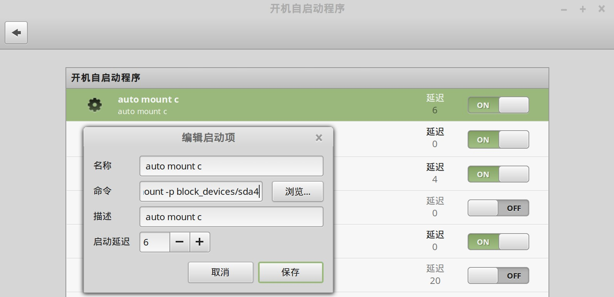

安装linux、windows双操作系统时，可以在linux下直接挂载windows的盘符，这样可以访问windows下的文件系统，非常方便。

新版本的ubuntu16.04、Linux mint 18都已经内置了ntfs的支持，只需要简单挂载就好。最方便的方式是在开机时自动挂载。

## 只读挂载

如果只是要求读取文件，不要求写入，则非常简单。开机自动执行 udisksctl 命令即可解决问题。

### 设置开机自动挂载

在开机自启动程序中，增加一个开机启动项，命令为：

```bash
udisksctl mount -p block_devices/nvme0n1p4
```



### 解决无法装载的问题

如果windows在关机时进行了休眠，则无法装载，报错如下：

```bash
Error mounting /dev/nvme0n1p4 at /media/sky/win10: Command-line `mount -t "ntfs" -o "uhelper=udisks2,nodev,nosuid,uid=1000,gid=1000" "/dev/nvme0n1p4" "/media/sky/win10"' exited with non-zero exit status 14: Windows is hibernated, refused to mount.
Failed to mount '/dev/nvme0n1p4': 不允许的操作
The NTFS partition is in an unsafe state. Please resume and shutdown
Windows fully (no hibernation or fast restarting), or mount the volume
read-only with the 'ro' mount option.
```

解决这个问题的最好方式是消除休眠状态。一般重新启动到windows下，然后再次重启进linux，就OK。

前提是已经关闭了windows的快速启动功能，不然还会继续报同样错误。关闭快速启动的办法是进入windows，在控制面板 -> 电源管理中，选择关闭盖子的功能，点击"不能更改的选项"，去掉快速启动的勾选。

但偶尔还是会遇到即使上面的事情都做好了，依然还是继续报错说"Windows is hibernated"。

此时需要想办法删除windows盘符上的休眠文件`hiberfil.sys`，具体作法是在linux中执行命令：

```bash
sudo mkdir /media/sky/win10
sudo ntfs-3g -o remove_hiberfile /dev/nvme0n1p4 /media/sky/win10
```

最恶劣的情况是，windows在即使关闭快速启动功能的情况下也还是会继续生成休眠文件，非常不可理喻。解决的方式是彻底关闭windows的休眠功能。以管理员权限启动命令行，执行命令：

```bash
powercfg /h off
```

### 参考资料

- [How to Do a Full Shutdown in Windows 8 Without Disabling Hybrid Boot](https://www.howtogeek.com/129021/how-to-do-a-full-shutdown-in-windows-8-without-disabling-hybrid-boot/)
- [How to mount Windows (NTFS) filesystem due to hibernation](https://wiki.manjaro.org/How_to_mount_Windows_(NTFS)_filesystem_due_to_hibernation): 这篇讲的很详细

## 读写挂载

如果要求有写入权限，则推荐直接修改 `/etc/fstab` 文件。

执行 

```bash
sudo lsblk -f
```

来查看各个盘符的 uuid：

```bash

NAME        FSTYPE FSVER LABEL UUID                                 FSAVAIL FSUSE% MOUNTPOINTS
nvme0n1
├─nvme0n1p1 vfat   FAT32       EC63-8FDF                              26.6M    72% /boot/efi
├─nvme0n1p2
├─nvme0n1p3 ntfs               1E1E79121E78E465
├─nvme0n1p4 ntfs               CA5096F75096E989
└─nvme0n1p5 ntfs         data  3AA6AC66A6AC247B                      595.4G    30% /media/sky/data
nvme1n1
├─nvme1n1p1 vfat   FAT32       8F75-FED5
├─nvme1n1p2 ext4   1.0         82e1f69a-06ff-42f6-972a-3bdf635b62fe  825.9G     3% /
└─nvme1n1p3 ext4   1.0         1730d77d-e91c-43ad-a883-c652c99541ae
```

这里我要自动挂载的是 nvme0n1p5 / uuid=3AA6AC66A6AC247B 的这个磁盘。系统之前临时把它挂载在了 /media/sky/data。为了开机自动挂载，需要确保这个目录始终存在：

```bash
sudo mkdir -p /media/sky/data

sudo vi /etc/fstab
```

加入内容：

```bash
UUID=3AA6AC66A6AC247B  /media/sky/data  ntfs-3g  defaults,nofail,uid=1000,gid=1000,dmask=022,fmask=133  0  0
```

参数解释：

- UUID=...：你的磁盘唯一标识符。
- /media/sky/data：挂载的目标目录。
- ntfs-3g：Linux 下可靠的 NTFS 读写驱动（也可以写成 ntfs 或 ntfs3）。
- defaults：使用默认的挂载设置。
- nofail：非常重要。如果这个磁盘损坏或被拔出，系统依然会正常开机，而不会卡在黑屏报错界面。
- uid=1000,gid=1000：将磁盘的所有权交给当前的用户（假设你的账号 uid 是 1000），确保有最高读写权限。
- dmask=022,fmask=133：合理的权限掩码，让文件夹权限为 755，文件权限为 644，避免所有文件都被当成可执行文件（在终端里全显示为绿色）。
- 0 0：不进行 dump 备份，开机不强制进行磁盘检查（NTFS 磁盘由 Windows 负责修复最好）。

重启之前，验证一下，先 umount。

```bash
sudo umount /media/sky/data
sudo systemctl daemon-reload
sudo mount -a
```

如果遇到报错：

```bash
The disk contains an unclean file system (0, 0).
Metadata kept in Windows cache, refused to mount.
Falling back to read-only mount because the NTFS partition is in an
unsafe state. Please resume and shutdown Windows fully (no hibernation
or fast restarting.)
Could not mount read-write, trying read-only
ntfs-3g-mount: failed to access mountpoint /media/sky/data: No such file or directory
mount: (hint) your fstab has been modified, but systemd still uses
the old version; use 'systemctl daemon-reload' to reload.
```

这表示 NTFS 磁盘被 Windows 锁定（导致只能只读），报错信息： The disk contains an unclean file system... Metadata kept in Windows cache, refused to mount.

原因：  Windows 快速启动 (Fast Startup) 或休眠功能引起的。Windows 并没有真正的“彻底关机”，而是把磁盘缓存状态挂起冻结了。Linux 为了防止损坏数据，拒绝以“读写”模式强行挂载。