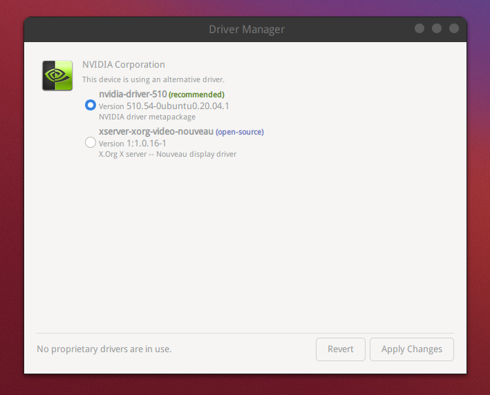

## 正常安装

"开始菜单" -> "系统管理" -> "驱动管理器"，

Linux Mint 会先做一次系统更新检查，然后给出可以安装的驱动列表。

只要简单选择需要的驱动版本，然后安装即可，如下图：




## 特殊情况

### 无法打开系统设置界面

有时会遇到无法打开系统设置界面的情况，导致无法进入设备管理器。

此时，可以在桌面右键，打开终端，然后执行 `/usr/bin/cinnamon-settings` 命令，即可打开设置界面。

### 无法进入图形界面

某一次更换显卡时，从adm rx580显卡换到nvidia 3070显卡，遇到无法显示图形界面的情况，黑色屏幕上只有左上角有一个光标一闪一闪。而且网络也莫名其妙的不通，无法ssh。

> 补充： 遇到第二次类似情况，cpu是 intel 13900hk 自带intel 集成显卡，安装 linux mint 后正常使用。后面接上 nvidia 的 4080 显卡之后，就出现同样问题。

解决方法：

1. 解决无法ssh的问题：按 `ctr+alt+F` 可以显示出 terminal 界面，输入用户名/密码就可以登录。期间如果再次黑屏，可以继续 按 `ctr+alt+F` 。登录之后，网络也就通了。

2. 安装 nvidia 显卡驱动

   ```bash
   sudo apt update
   sudo apt-cache search nvidia-driver
   sudo apt install nvidia-driver-545 # 这里选择合适的驱动版本，比如
   ```

   安装完成之后重启即可，正常显示图形界面。

参考资料：

- [ubuntu20.04 安装nvidia显卡驱动后无法启动系统的解决办法](https://blog.csdn.net/csdnlg112/article/details/124718836)

  
