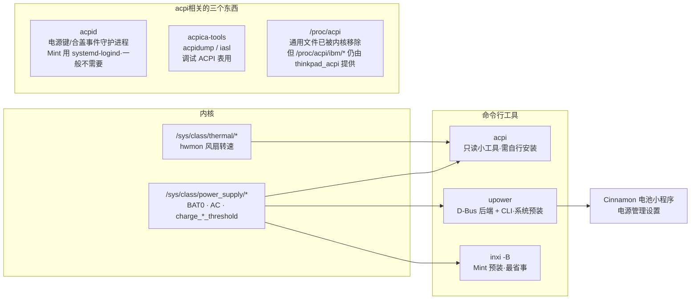
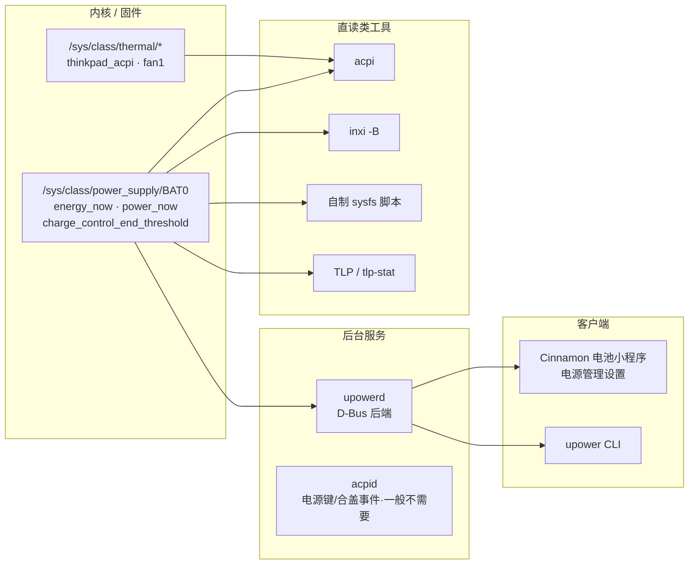

## 工具介绍

一句话：要装的是 acpi（只读小命令）；acpid 是事件守护进程，Mint 上通常用不到；acpica-tools 是另一套查 ACPI 表的工具。

```mermaid
flowchart LR
    subgraph K["内核"]
        S["/sys/class/power_supply/*<br/>BAT0 · AC · charge_*_threshold"]
        T["/sys/class/thermal/*<br/>hwmon 风扇转速"]
    end
    subgraph CLI["命令行工具"]
        A["acpi<br/>只读小工具·需自行安装"]
        U["upower<br/>D-Bus 后端 + CLI·系统预装"]
        X["inxi -B<br/>Mint 预装·最省事"]
    end
    subgraph D["acpi相关的三个东西"]
        D1["acpid<br/>电源键/合盖事件守护进程<br/>Mint 用 systemd-logind·一般不需要"]
        D2["acpica-tools<br/>acpidump / iasl<br/>调试 ACPI 表用"]
        D3["/proc/acpi<br/>通用文件已被内核移除<br/>但 /proc/acpi/ibm/* 仍由 thinkpad_acpi 提供"]
    end
    S --> A
    S --> U
    S --> X
    T --> A
    U --> C["Cinnamon 电池小程序<br/>电源管理设置"]
```

工作原理和数据流向（谁从哪读取数据）：

```mermaid
flowchart LR
    subgraph KER["内核 / 固件"]
        A["/sys/class/power_supply/BAT0<br/>energy_now · power_now<br/>charge_control_end_threshold"]
        B["/sys/class/thermal/*<br/>thinkpad_acpi · fan1"]
    end
    subgraph SVC["后台服务"]
        U["upowerd<br/>D-Bus 后端"]
        ACPID["acpid<br/>电源键/合盖事件·一般不需要"]
    end
    subgraph CLIENT["客户端"]
        G["Cinnamon 电池小程序<br/>电源管理设置"]
        UC["upower CLI"]
    end
    subgraph DIR["直读类工具"]
        AC["acpi"]
        IX["inxi -B"]
        SC["自制 sysfs 脚本"]
        TL["TLP / tlp-stat"]
    end
    A --> U
    A --> AC
    A --> IX
    A --> SC
    A --> TL
    B --> AC
    U --> G
    U --> UC
```