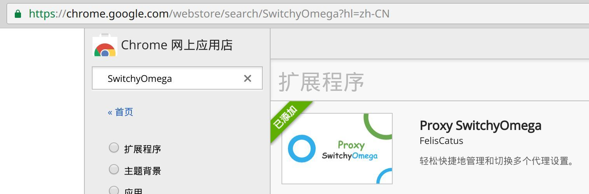
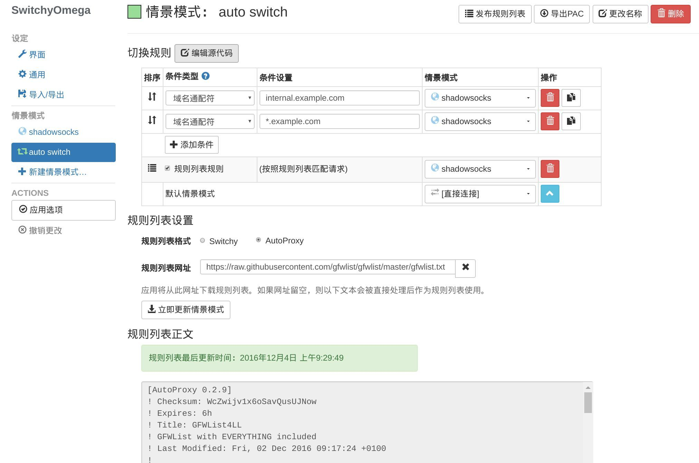

# Google chrome 浏览器

tags:翻墙,浏览器

chrome 浏览器个人最喜欢的浏览器。

## 安装

在chrome官方下载适合的 amd 64位的 debian 版本，或者直接用这个下载链接下载最新版本:

https://dl.google.com/linux/direct/google-chrome-stable_current_amd64.deb

然后直接用 `GDebi package installer` 安装即可。

## 插件

chrown 的webstore，可以从这里寻找和安装插件：

https://chrome.google.com/webstore/category/extensions?hl=zh-CN

### SwitchyOmega

在google chrome 中可以安装 SwitchyOmega 插件来方便的管理代理服务器(还是主要为了翻墙),然后加入场景设置使用本地 shadowsocks 作为代理服务器.

#### 安装SwitchyOmega

搜索 `SwitchyOmega` ，然后直接安装：

#### 配置shadowsocks

注意:代理协议一定要设置为 SOCKS5.

#### 设置自动切换

为了方便, SwitchyOmega 中设置自动切换,规则列表设置格式为 `AutoProxy`。

规则列表网址为下面地址,保存后更新:

https://raw.githubusercontent.com/gfwlist/gfwlist/master/gfwlist.txt

这样用 chrome 上网就可以自动切换代理,需要翻墙时自动连 shadowsocks,不需要时直连.

