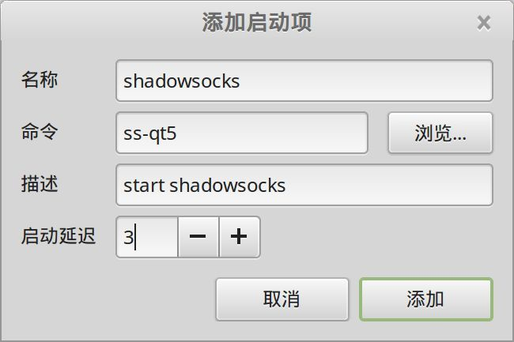

# shadowsocks科学上网

tags: shadowsocks

### linux客户端

从 [shadowsocks-gui](https://github.com/shadowsocks/shadowsocks-gui) 得知，linux客户端是 `shadowsocks-qt5`，提供中文版本的安装指南 。赞！

按照安装指南，执行安装：

```bash
sudo add-apt-repository ppa:hzwhuang/ss-qt5
sudo apt-get update
sudo apt-get install shadowsocks-qt5
```

安装完成后，执行命令启动：

```bash
ss-qt5
```

图形界面上可以找到shadowsocks-qt5的图标，或者gnome do 之类的工具也可以。

启动后配置和windows版本类似。

### 开机自启动

为 shadowsocks 添加开机自动启动, "开始菜单" -> "首选项" -> "开机自启动程序", 点 "添加" --> "选择程序"，找到 "Shadowsocks-Qt5",添加后再修改启动延迟：



## 设置全局代理

参考资料: [Ubuntu 16安装shadowsocks-qt5并使用PAC全局代理](https://www.litcc.com/2016/12/29/Ubuntu16-shadowsocks-pac/)

1. 安装 pip

	```bash
	sudo apt-get install python-pip
	pip install --upgrade pip
	```

2. 安装GenPAC

	GenPAC 是基于gfwlist的代理自动配置（Proxy Auto-config）文件生成工具，支持自定义规则。

	```bash
	sudo pip install setuptools
	sudo pip install genpac
	pip install --upgrade genpac
	```

3. 下载gfwlist

	```bash
	genpac -p "SOCKS5 127.0.0.1:11080" --gfwlist-proxy="SOCKS5 127.0.0.1:11080" --gfwlist-url=https://raw.githubusercontent.com/gfwlist/gfwlist/master/gfwlist.txt --output="/home/sky/work/soft/pac/autoproxy.pac"
    ```

4. 设置系统网络代理为自动，url为 `file:///home/sky/work/soft/pac/autoproxy.pac`

上面的方式，有些情况下会无效，因此不得不继续寻找其他方法。

- [Convert Shadowsocks into an HTTP proxy](https://github.com/shadowsocks/shadowsocks/wiki/Convert-Shadowsocks-into-an-HTTP-proxy)
- [为终端设置Shadowsocks代理](http://droidyue.com/blog/2016/04/04/set-shadowsocks-proxy-for-terminal/)
- [Centos 7 搭建 Shadowsocks 配置 iptables 规则](https://www.micronbot.com/Linux/13.html)

http://droidyue.com/blog/2016/04/04/set-shadowsocks-proxy-for-terminal/

```bash
sudo apt-get install polipo
```

然后打开配置文件 `/etc/polipo/config`


1. 设置ParentProxy为Shadowsocks，通常情况下本机shadowsocks的地址如下
2. 设置日志输出文件

```bash
socksParentProxy = "localhost:11080"
socksProxyType = socks5
logFile=/var/log/polipo
logLevel=4
```