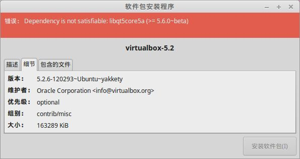

# VirtualBox

## VirtualBox5.1

5.1系列安装很简单，下载地址:

https://www.virtualbox.org/wiki/Downloads

- VirtualBox 5.1.26 platform packages
- VirtualBox 5.1.26 Oracle VM VirtualBox Extension Pack

安装下载的　`virtualbox-5.1_5.1.26-117224-Ubuntu-xenial_amd64.deb`

完成后，双击 `Oracle_VM_VirtualBox_Extension_Pack-5.1.26-117224.vbox-extpack` 再安装扩展包.

## VirtualBox5.2

5.2版本安装要麻烦一些，主要是5.2要求libqt5core5a的版本比较高：



可以通过apt来安装，直接一步到位。

1. 修改 `/etc/apt/sources.list` 加入一下内容：

    ```bash
    deb http://download.virtualbox.org/virtualbox/debian xenial contrib
    ```

2. 执行下列安装命令

    ```bash
    wget -q https://www.virtualbox.org/download/oracle_vbox_2016.asc -O- | sudo apt-key add -
    wget -q https://www.virtualbox.org/download/oracle_vbox.asc -O- | sudo apt-key add -
    sudo apt-get update
    sudo apt-get install virtualbox-5.2
    ```

3. 启动新装的virtualbox，会提示更新扩展包，按照提示操作即可

> 参考资料: [How to Install Oracle VirtualBox 5.2 on Ubuntu 17.10/16.04, Debian 9/8](https://tecadmin.net/install-oracle-virtualbox-on-ubuntu/#)

## 补充

使用时，发现 virtualbox 不能很好的支持显卡硬件加速，分辨率无法设置太高。

如果用来安装windows虚拟机的话不合适，还是继续 vmware.

用来跑minikube之类就无影响。
