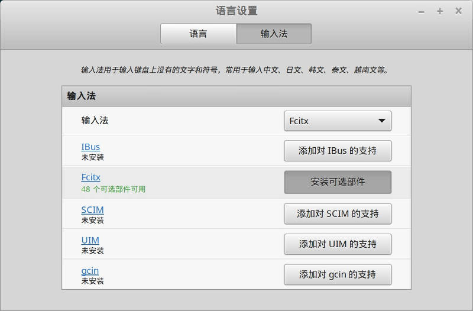
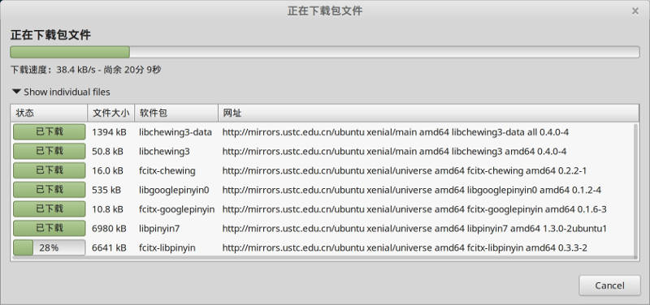

# 搜狗输入法

tags:输入法

Linux Mint 18 是基于 ubuntu 16.04，比较新，之前的 搜狗输入法 安装方式无法使用，因此需要另想办法

## 安装

安装步骤如下：

1. 进入搜狗输入法官网，下载 Linux 64位版本

	http://pinyin.sogou.com/linux/?r=pinyin

	最新版本已经支持 Ubuntu12.04、14.04及16.04。

2. 在终端中执行命令：

	```bash
	sudo dpkg -i sogoupinyin_2.0.0.0072_amd64.deb
    ```

    安装过程中会因为缺少依赖包而失败。

3. 安装依赖，在终端输入：

	```bash
	sudo apt-get install -f
    ```

	安装所有缺失的依赖关系。

4. 再次输入命令

	```bash
	sudo dpkg -i sogoupinyin_2.0.0.0072_amd64.deb
    ```

5. 重启系统，完成安装

安装完成之后，在设置时会提示：

    You're currently running Fcitx with GUI, but fcitx-configtool couldn't be found, the package name is usually fcitx-config-gtk, fcitx-config-gtk3 or fcitx-configtool. Now it will open config file with default text editor.

需要再安装一下`fcitx-config-gtk`：

```bash
sudo apt-get install fcitx-config-gtk
```

## 设置

打开 "开始菜单" -> "首选项" -> "输入法"，可以看到输入法已经默认为fcitx：


但是显示 "缺少13个部件"，点击 "安装缺失的部件"。安装完成之后，继续报告说 "48个可选部件可用"：



如果继续安装，则会下载安装下面的内容，看名字时其他各种输入法，感觉没有必要，可以直接点 cancel 中断。


