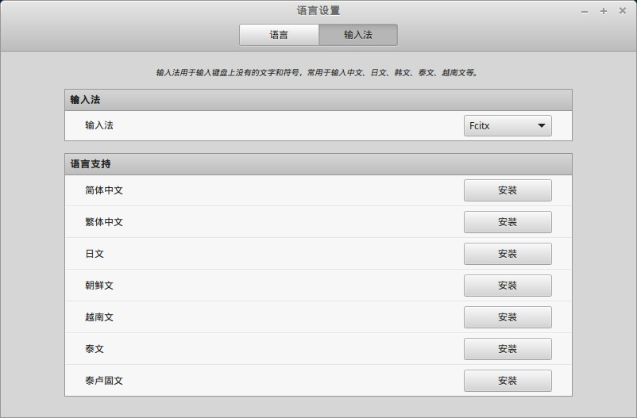
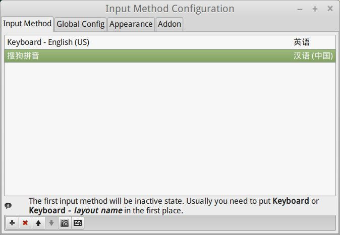

# 搜狗输入法

tags:输入法

## 安装

安装步骤如下：

1. 进入搜狗输入法官网，下载 Linux 64位版本

	http://pinyin.sogou.com/linux/?r=pinyin

	最新版本已经支持 Ubuntu12.04、14.04及16.04，而且对 linux mint 18 的支持非常好。

2. 在终端中执行命令：

	```bash
	sudo dpkg -i sogoupinyin_2.1.0.0086_amd64.deb
    ```

3. 重启系统，完成安装

安装完成之后，在设置时会提示：

    You're currently running Fcitx with GUI, but fcitx-configtool couldn't be found, the package name is usually fcitx-config-gtk, fcitx-config-gtk3 or fcitx-configtool. Now it will open config file with default text editor.

需要再安装一下`fcitx-config-gtk`：

```bash
sudo apt-get install fcitx-config-gtk
```

## 设置

打开 "开始菜单" -> "首选项" -> "输入法"，可以看到输入法已经默认为fcitx：



打开 "开始菜单" -> "首选项" -> "Fcitx 配置", 设置如下：



"Global Config" 里面可以看到相关的设置：


部分细节：

1. 切换输入法的快捷键是 `Ctrl+Space`
2. 上一页的快捷键是 `-` 或者 `,`
3. 下一页的快捷键是 `=` 或者 `.`
4. "Candidate Word Number"用来设置候选词的个数