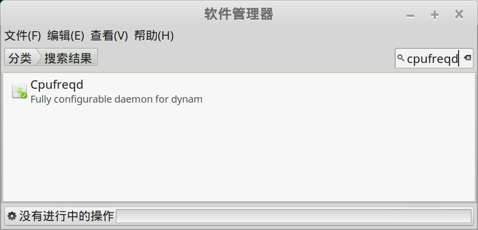

# cpufreqd

tags:cpufreqd,节能,cpu,开机自启动

折腾 linux mint 的时候,发现linux系统节能方面表现不太好. 后来找到了cpufreqd这个工具, 使用后发现非常好用,可以自定义规则来满足各种情况下的cpu设定, 极度灵活。

叹为观止, 在 cpu 频率调整方面堪称神器，强烈推荐给笔记本用户.

##  安装

安装简单，在18之前的linux mint版本中还需要加ppa仓库:

```bash
sudo add-apt-repository ppa:artfwo/ppa
sudo apt-get update
sudo apt-get install cpufreqd
```

而在 linux mint 18中发现直接用软件管理器安装，不用添加ppa。

"开始菜单" -> "系统管理" -> "软件管理器"，搜索 `cpufreqd`:



直接安装即可。

## 配置

### 设置配置文件

cpufreqd 的精髓在于它可以通过配置文件来定制行为, 下面可以看到cpufreqd启动时时读取/etc/cpufreqd.conf中的配置信息:

```bash
$ ps -ef | grep cpu
root      1910     1  0 14:19 ?        00:00:01 /usr/sbin/cpufreqd -f /etc/cpufreqd.conf
```

 cpufreqd.conf详细的配置文档说明请见下文(英文版): [cpufreqd.conf - configuration file for cpufreqd](http://manpages.ubuntu.com/manpages/natty/man5/cpufreqd.conf.5.html).

### 开机自启动

cpufreqd 是一个命令行工具，因此开机自启动需要手工添加。

"开始菜单" -> "首选项" -> "开机自启动程序"，如图添加：


## 定制方案

### 我的定制方案

下面是我给自己定制的cpu频率设置:

```bash
# when AC on & cpu is cool & has load, feel free to enjoy full performance
[Rule]
name=AC Rule
ac=on                    # (on/off)
acpi_temperature=0-40
cpu_interval=10-100
profile=Performance High
[/Rule]

# when AC on & cpu is cool & no load, On Demand High
[Rule]
name=AC Rule
ac=on                    # (on/off)
acpi_temperature=0-40
cpu_interval=0-10
profile=On Demand High
[/Rule]

# when AC on but cpu is not cool, turn to on demand high
[Rule]
name=AC Rule
ac=on                    # (on/off)
acpi_temperature=40-50
profile=On Demand High
[/Rule]

# when AC on but cpu is hot, turn to on demand low
[Rule]
name=AC Rule
ac=on                    # (on/off)
acpi_temperature=50-100
profile=On Demand Low
[/Rule]

# when AC off and battery is enough, set to On Demand High
[Rule]
name=AC Off - High Battery
ac=off                   # (on/off)
battery_interval=50-100
profile=On Demand High
[/Rule]

# when AC off and battery is not enough, set to On Demand Low
[Rule]
name=AC Off - Low Battery
ac=off                   # (on/off)
battery_interval=20-50
profile=On Demand Low
[/Rule]

# when AC off and battery is very low, set to Powersave Low
[Rule]
name=AC Off - almost no Battery
ac=off                   # (on/off)
battery_interval=0-20
profile=Powersave Low
[/Rule]
```

### 思路解析

1. AC on: 有电源,这种情况下电力不是问题, 主要考虑性能和温度的均衡

    主要看温度:

    - 如果温度低(< 40), 此时既有电力又不发热, 则可以尽量开始高性能, 因此有cpu负载时就直接100%频率使用, 如果没有负载就 ondemand high.
    - 如果温度不高也不低(40-50), 用 ondemand high
    - 如果温度已经很高了(> 50), 用 ondemand low

1. AC off: 没有电源, 这种情况下主要时考虑节电, 性能需要尽量压制, 而温度通常不会是问题.

    主要考虑电力:

    - 当电力充足时 (>50%), 设置 On Demand High
    - 当电力不太多时(20% - 50%), 设置 On Demand Low
    - 当电力接近耗尽时(< 20%), 强制降频到最低, 设置Powersave Low

### 修改 profile 设定

默认的profile 有几个地方设置我不太满意, 自己修改了一下:

1. 打开了On Demand High/On Demand Low, 看说明是因为在某些平台上ondemand不被支持,因此默认时关闭的. 我测试了发现我的机器时支持的,因此开启, 这个明显比直接设置固定频率要实用.

2. 修改了Powersave Low, 默认是40% cpu, 但是考虑我的方案中, 这个profile只有在最恶劣的情况(无电源+电池电力接近耗尽) 下使用, 因此40% 还是高了点,我直接设置为20%了

### 配置文件参考

下面是默认配置文件和我定制的配置文件,仅供参考:

- [我的定制配置文件](images/linux-cpufreqd/cpufreqd.conf)
- [默认的配置文件](images/linux-cpufreqd/cpufreqd-original.conf)

## 更多功能

看到配置中支持针对某些应用做特殊设置, 比如默认配置中有这个例子:

```bash
# use performance mode if I'm watching a movie
# I don't care for batteries!
# But don't heat too much.
[Rule]
name=Movie Watcher
programs=xine,mplayer,gmplayer
battery_interval=0-100
acpi_temperature=0-60
cpu_interval=0-100
profile=Performance High
[/Rule]
```

以后考虑针对自己的实际情况再做调整, 感觉 programs 这个参数可以增加很多的想象空间 :)


