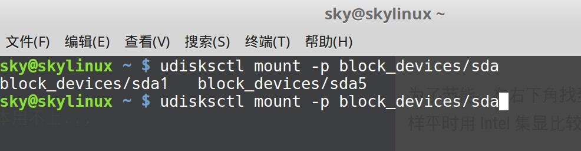

# 硬件配置

tags: 驱动,触摸板,节能,exfat,开机自启动

安装完成之后，需要做必要的硬件配置。

## 功能设置

### 触摸板

"开始菜单" -> "系统设置" -> "鼠标和触摸板"，点 "触摸板"，开启 “打字时禁用触摸板”。实在不能忍受打字时不小心碰到触摸板,然后光标跑不知道哪里去了的感觉......

但是，随即发现打字时还是容易被触摸板影响，最后只好选择关闭触摸板。

## 硬件设置

### 驱动安装

"开始菜单" -> "系统管理" -> "驱动管理器"，

Linux Mint 会先做一次系统更新检查，然后给出可以安装的驱动列表。

只要简单选择需要的驱动版本，然后安装即可，如下图：


为了节能，在右下角找到 nvidia 的图标，设置中找到 ”select the gpu you would like to use”，默认时NVIDIA，修改为 Intel，这样平时用 Intel 集显比较节能省电噪音低。

然后，在需要用到 nvidia 独立显卡时，可以再改回来。坦言，好像基本用不上...

### exfat支持

移动硬盘一般用的文件格式exfat，mint linux 默认不支持，需要安装 exfat-fuse / exfat-utils:

```bash
sudo apt-get install exfat-fuse exfat-utils
```

重启后生效。

### 自动装载windows分区

linux mint 安装之后自带了ntfs-3g, 天然支持ntfs格式。

"开始菜单" -> "首选项" -> "开机自启动程序"，在开机自启动程序中增加开机自动装载windows分区的命令:

```bash
udisksctl mount -p block_devices/sdb4
```

具体有哪些分区可供装载，可以通过在命令行中输入 `udisksctl mount -p block_devices/` 然后双击 Tab 键列出来，如下图：



开机自启动设置如下：


