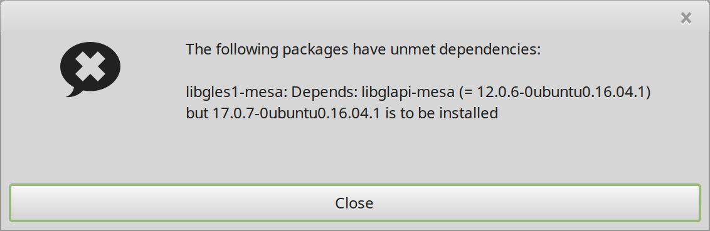
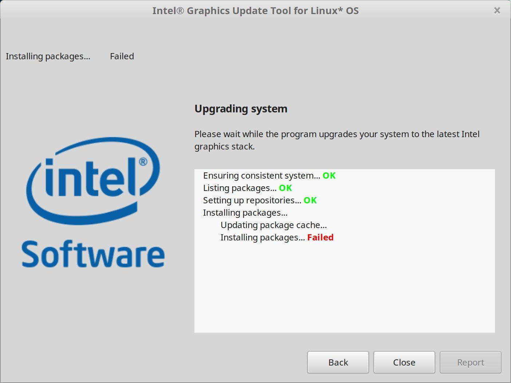

# Intel显卡驱动安装

虽说　linux mint 默认自带了 intel 集成显卡驱动，不过从实际使用情况看，这个驱动在节能方面表现应该不好。对比 windows 系统，在发热和续航时间上差距明显。考虑 cpu 已经优化到极致（基本空载和低负载时都是0.9G频率），考虑优化一下显卡。

## 下载更新工具

官方会指向下面的开源社区网站，支持 ubuntu 16.04 的最新驱动是　v2.0.2　:

https://01.org/zh/linuxgraphics/downloads/intel-graphics-update-tool-linux-os-v2.0.2

下载64位版本　`intel-graphics-update-tool_2.0.2_amd64.deb`。

> 注：支持更高版本ubuntu的驱动，如 2.0.5　版本的驱动，测试过无法安装。

## 安装更新工具

linux mint　在安装 intel 更新工具时，需要修改发行版本的信息，否者会无法安装。参考下文:

https://unix.stackexchange.com/questions/315049/cannot-install-intel-graphics-driver-on-linux-mint-18

修改修改　`/etc/lsb-release` 文件，将 linuxmint 信息修改回　ubuntu：

```bash
#DISTRIB_ID=LinuxMint
#DISTRIB_RELEASE=18
#DISTRIB_CODENAME=sarah
#DISTRIB_DESCRIPTION="Linux Mint 18 Sarah"
DISTRIB_ID=Ubuntu
DISTRIB_RELEASE=16.04
DISTRIB_CODENAME=xenial
DISTRIB_DESCRIPTION="Ubuntu 16.04 LTS"
```

保存后退出。然后更新。

```bash
sudo apt-get update
```

然后继续安装。安装完成之后再将　`/etc/lsb-release` 文件恢复：

```bash
DISTRIB_ID=LinuxMint
DISTRIB_RELEASE=18
DISTRIB_CODENAME=sarah
DISTRIB_DESCRIPTION="Linux Mint 18 Sarah"
#DISTRIB_ID=Ubuntu
#DISTRIB_RELEASE=16.04
#DISTRIB_CODENAME=xenial
#DISTRIB_DESCRIPTION="Ubuntu 16.04 LTS"
```

## 更新系统

```bash
wget --no-check-certificate https://download.01.org/gfx/RPM-GPG-KEY-ilg-4 -O - | \ sudo apt-key add -
sudo apt update && sudo apt full-upgrade
```

## 更新驱动

在应用中找到 intel update tool，开始安装。

遇到问题：




导致安装失败:



不得已放弃。
